# 03 — Architecture Diagram

## 1. Purpose

This document provides the detailed visual reference for the Production DevOps Capstone.

The diagrams translate the logical architecture from:

```text
01-Capstone-Requirements.md
02-Production-Architecture.md
```

into operational views that can be used while implementing:

```text
AWS
VPC
EKS
Kubernetes
Terraform
ECR
CI
DevSecOps
GitOps
Argo CD
Helm
ALB
Secrets
Messaging
Monitoring
Logging
Tracing
DR
Security
```

The diagrams use Mermaid syntax wherever possible so they can be copied into GitLab, GitHub, Markdown viewers, documentation systems, or architecture tools that support Mermaid.

---

# 2. Architecture Legend

The following conventions are used throughout the diagrams.

```text
Internet / User
        |
        v
Ingress / Entry Point
        |
        v
Application
        |
        v
Data / Dependency
```

Infrastructure control flow:

```text
Code
 |
Terraform
 |
AWS
```

Application delivery flow:

```text
Source
 |
CI
 |
Artifact
 |
GitOps
 |
Argo CD
 |
Kubernetes
```

Observability flow:

```text
Application
 |
Metrics / Logs / Traces
 |
Collectors
 |
Storage / Analysis
 |
Dashboard / Alert
```

---

# 3. Complete End-to-End Architecture

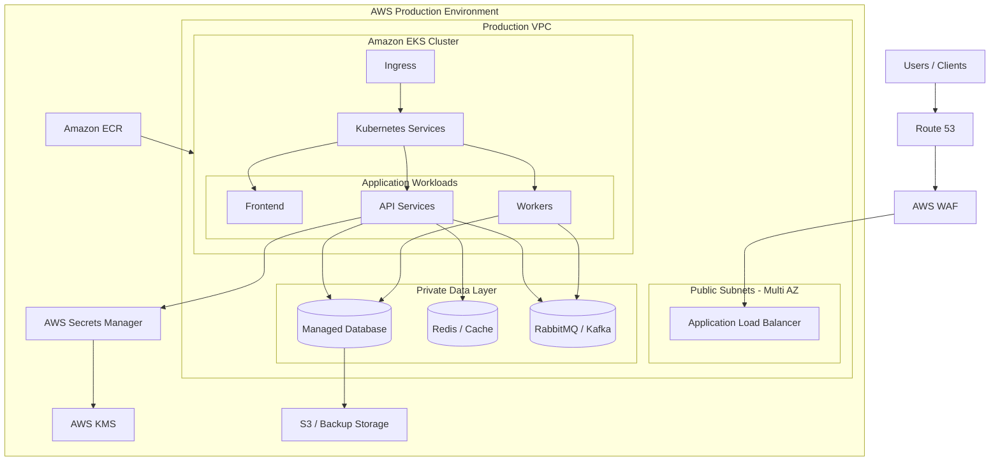

---

# 4. AWS Account Architecture

Production should be separated from non-production workloads.

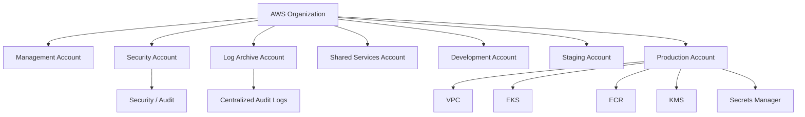

---

# 5. Multi-Region Architecture

Primary and disaster-recovery regions:

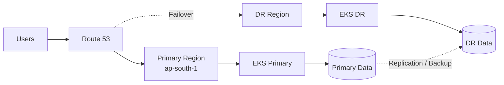

The actual DR design depends on:

```text
RPO
RTO
data replication capability
application architecture
business criticality
cost
```

---

# 6. Region and Availability Zone Diagram

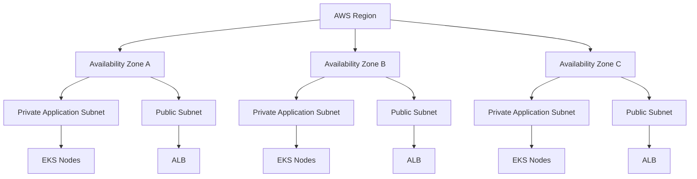

---

# 7. VPC Architecture

Example CIDR:

```text
10.0.0.0/16
```

Logical segmentation:

```text
VPC 10.0.0.0/16

+-----------------------------------------------------+
|                                                     |
| Public Subnets                                      |
|                                                     |
|  AZ-A       AZ-B       AZ-C                         |
|  ALB        ALB        ALB                          |
|                                                     |
+-----------------------------------------------------+
|                                                     |
| Private Application Subnets                         |
|                                                     |
|  AZ-A       AZ-B       AZ-C                         |
|  EKS        EKS        EKS                          |
|                                                     |
+-----------------------------------------------------+
|                                                     |
| Private Data Subnets                                |
|                                                     |
|  AZ-A       AZ-B       AZ-C                         |
|  Data       Data       Data                         |
|                                                     |
+-----------------------------------------------------+
```

---

# 8. VPC Mermaid Diagram

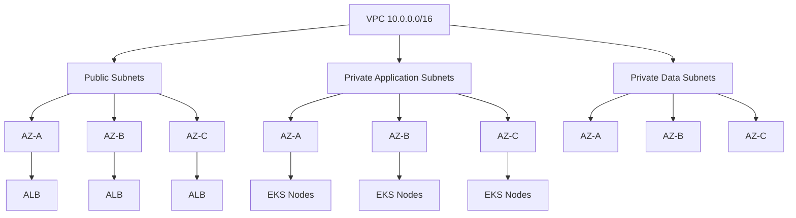

---

# 9. Internet Traffic Flow

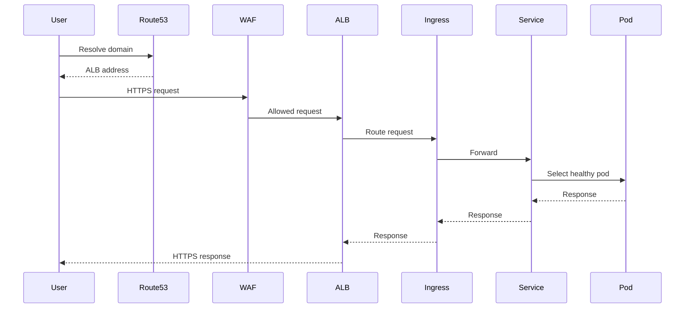

---

# 10. ALB to Kubernetes Flow

```text
Client
  |
  | HTTPS 443
  v
Route 53
  |
  v
ALB
  |
  v
Ingress
  |
  v
Kubernetes Service
  |
  v
Pod
```

Important health boundaries:

```text
ALB health
Ingress health
Service endpoints
Pod readiness
Application health
Dependency health
```

---

# 11. Kubernetes Cluster Architecture

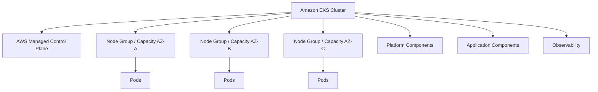

---

# 12. Kubernetes Node Distribution

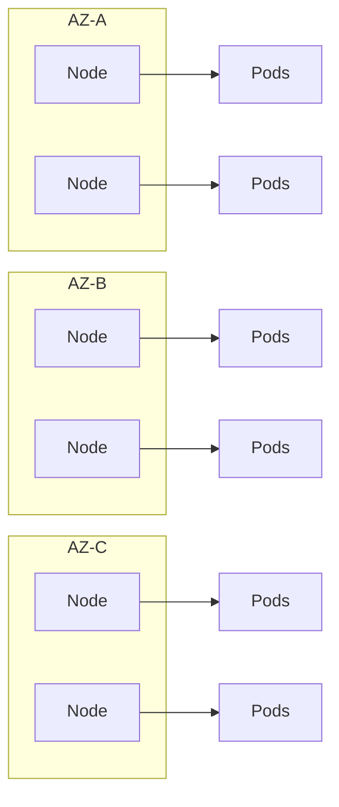

Critical replicas should be distributed rather than concentrated on one node or AZ.

---

# 13. Kubernetes Namespace Architecture

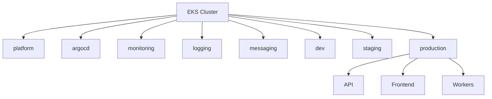

Namespace names are examples; the actual repository should standardize them.

---

# 14. Application Architecture

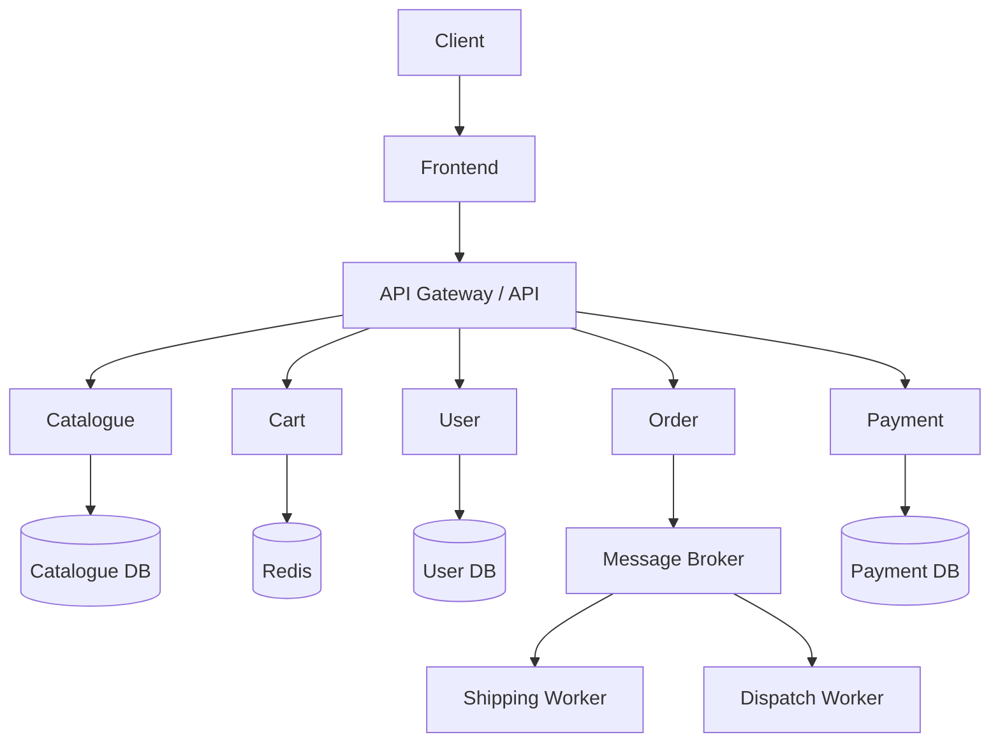

This demonstrates service boundaries; actual application decomposition depends on the capstone implementation.

---

# 15. Synchronous Application Flow

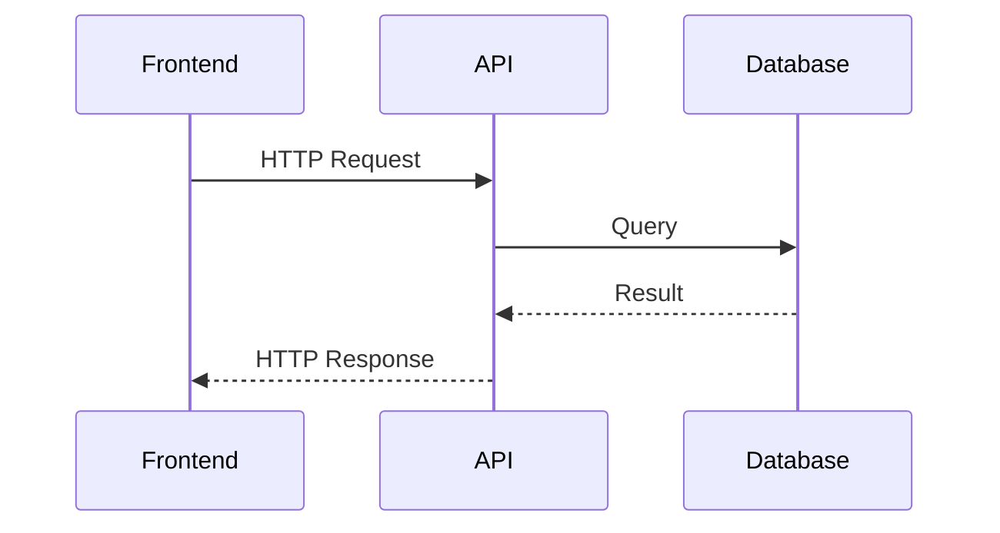

---

# 16. Asynchronous Application Flow

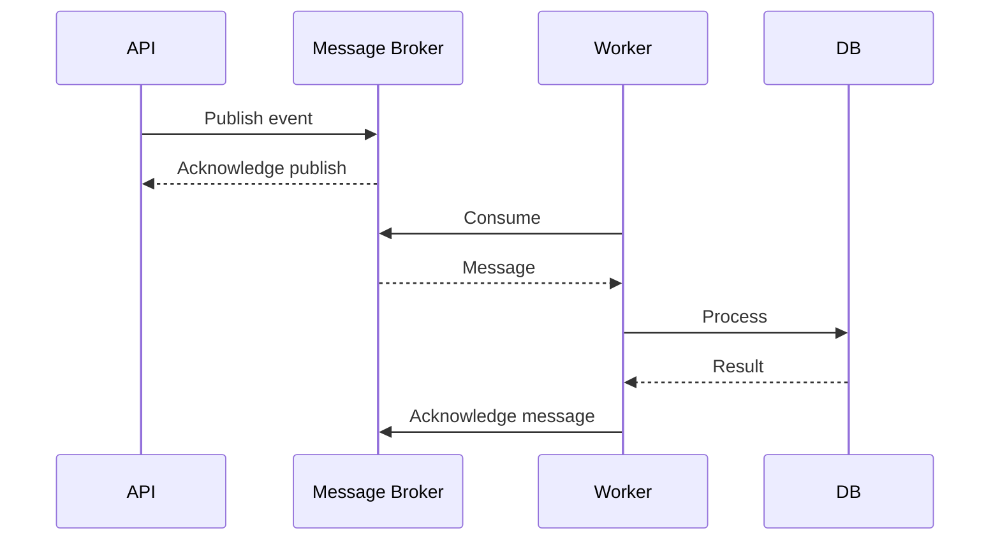

---

# 17. RabbitMQ Architecture

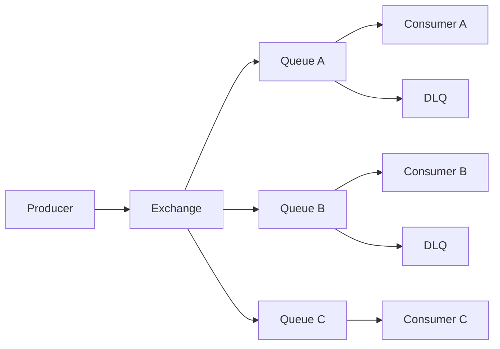

---

# 18. Kafka Architecture

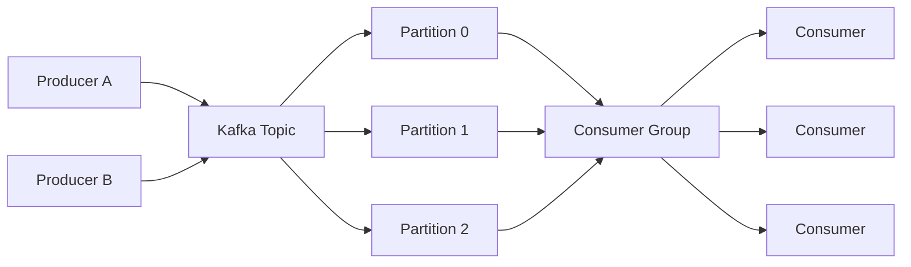

---

# 19. CI Architecture

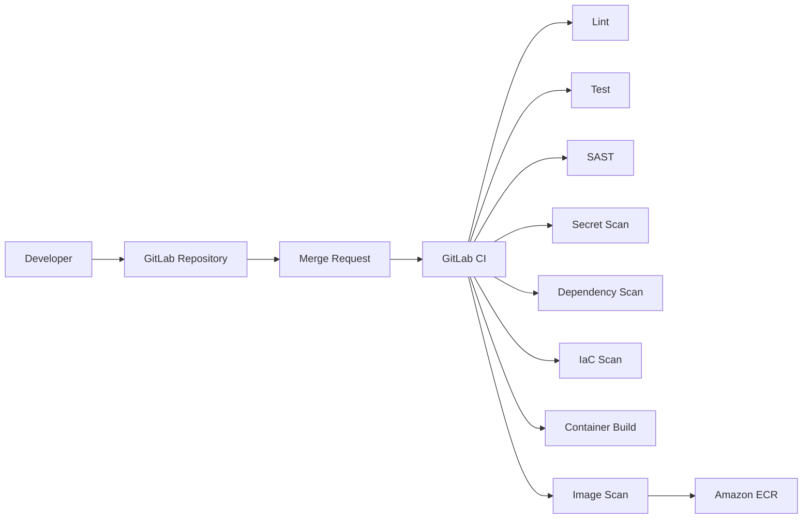

---

# 20. CI Stage Dependency

```text
Source
 |
Validate
 |
Unit Test
 |
Security Scan
 |
Build
 |
Image Scan
 |
Push
 |
Artifact Metadata
```

A failed mandatory stage should prevent promotion.

---

# 21. DevSecOps Pipeline

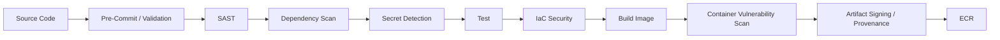

---

# 22. Terraform Architecture

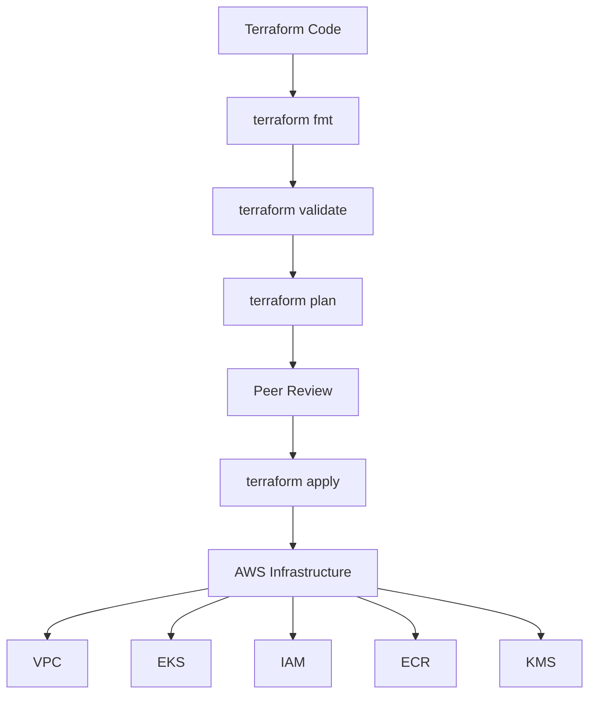

---

# 23. Terraform State Architecture

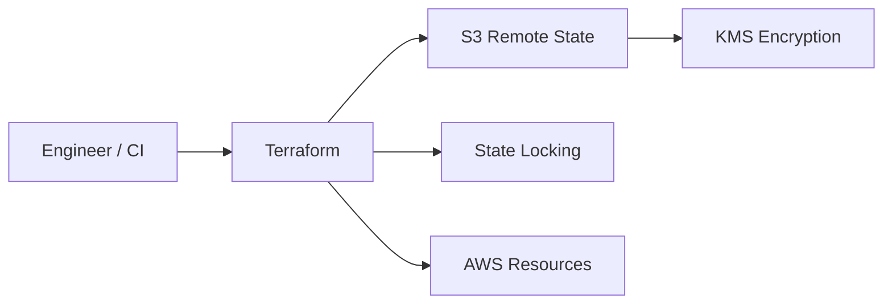

State must be protected because it may contain sensitive infrastructure information.

---

# 24. ECR Architecture

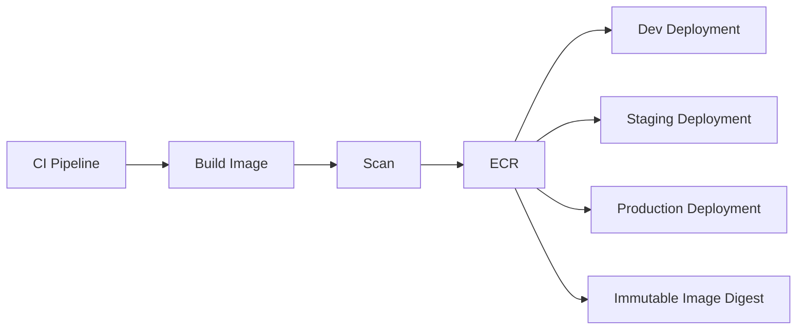

Promotion should prefer immutable digests.

---

# 25. GitOps Architecture

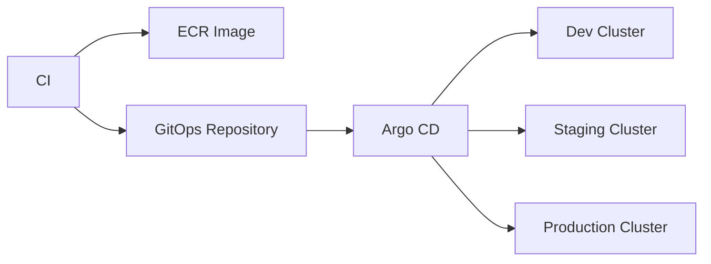

---

# 26. Argo CD Reconciliation

```mermaid
flowchart TB

    GIT[GitOps Desired State]

    GIT --> ARGO[Argo CD]

    ARGO --> DIFF{Desired == Live?}

    DIFF -->|Yes| SYNC[Healthy / Synced]
    DIFF -->|No| CHANGE[Apply Desired State]

    CHANGE --> CLUSTER[EKS]

    CLUSTER --> STATUS[Live State]
    STATUS --> ARGO
```

This is the core GitOps reconciliation loop.

---

# 27. Multi-Environment GitOps

```mermaid
flowchart TB

    REPO[GitOps Repository]

    REPO --> DEV[Development]
    REPO --> STAGE[Staging]
    REPO --> PROD[Production]

    DEV --> DCL[EKS Dev]
    STAGE --> SCL[EKS Staging]
    PROD --> PCL[EKS Production]
```

---

# 28. Multi-Cluster Argo CD

```mermaid
flowchart TB

    ARGO[Central Argo CD]

    ARGO --> CL1[Dev EKS]
    ARGO --> CL2[Staging EKS]
    ARGO --> CL3[Production EKS]
    ARGO --> CL4[DR EKS]
```

Access must be controlled carefully because Argo CD can deploy into multiple clusters.

---

# 29. Secrets Architecture

```mermaid
flowchart LR

    POD[Application Pod]

    POD --> SA[ServiceAccount]
    SA --> IAM[IAM Role]
    IAM --> SM[AWS Secrets Manager]

    SM --> SECRET[Secret Value]

    SECRET --> ESO[External Secrets]
    ESO --> K8S[Kubernetes Secret]
    K8S --> POD
```

The exact secret synchronization mechanism may vary, but static secrets should not be committed to Git.

---

# 30. IAM Architecture

```mermaid
flowchart TB

    USER[Engineer]

    USER --> SSO[Identity / SSO]
    SSO --> ROLE[IAM Role]

    ROLE --> AWS[AWS Resources]

    POD[Pod]
    POD --> IRSA[Pod IAM Identity]
    IRSA --> ROLE2[IAM Role]
    ROLE2 --> AWS2[AWS Services]
```

Human and workload permissions should be separated.

---

# 31. Security Architecture

```mermaid
flowchart TB

    INTERNET[Internet]

    INTERNET --> WAF[WAF]
    WAF --> ALB[ALB]
    ALB --> INGRESS[Ingress]

    INGRESS --> NETWORK[NetworkPolicy]
    NETWORK --> RBAC[RBAC]
    RBAC --> PODSEC[Pod Security]
    PODSEC --> APP[Application]

    APP --> SECRET[Secrets]
    APP --> DATA[Data]

    APP --> AUDIT[Audit / Logs]
```

Security is layered rather than dependent on one control.

---

# 32. Kubernetes NetworkPolicy Flow

```mermaid
flowchart LR

    FRONT[Frontend]
    API[API]
    DB[(Database)]
    REDIS[(Redis)]

    FRONT --> API
    API --> DB
    API --> REDIS

    FRONT -.Denied.-> DB
    FRONT -.Denied.-> REDIS
```

The actual policy should explicitly allow required flows and deny unnecessary lateral access.

---

# 33. ALB Security Boundary

```text
Internet
   |
   | 443
   v
ALB Security Group
   |
   | Application traffic
   v
EKS / Ingress
   |
   v
Application
```

Database security groups should not accept traffic directly from the internet.

---

# 34. Monitoring Architecture

```mermaid
flowchart LR

    APP[Applications]

    APP --> METRICS[Metrics]
    METRICS --> PROM[Prometheus]

    PROM --> GRAF[Grafana]
    PROM --> ALERT[Alertmanager]

    ALERT --> NOTIFY[Notification Channels]
```

---

# 35. Logging Architecture

```mermaid
flowchart LR

    POD[Application Pods]

    POD --> COLLECTOR[Log Collector]

    COLLECTOR --> ES[Elasticsearch]

    ES --> KIBANA[Kibana]

    KIBANA --> ENGINEER[Engineer]
```

---

# 36. Distributed Tracing Architecture

```mermaid
flowchart LR

    FE[Frontend]
    API[API]
    DB[Database]
    MQ[Message Broker]
    WORKER[Worker]

    FE --> OTEL[OpenTelemetry]
    API --> OTEL
    DB --> OTEL
    MQ --> OTEL
    WORKER --> OTEL

    OTEL --> JAEGER[Jaeger]

    JAEGER --> TRACE[Trace Analysis]
```

---

# 37. Three Pillars

```text
                 Observability
                      |
        +-------------+-------------+
        |             |             |
      Metrics        Logs         Traces
        |             |             |
    Prometheus        ELK          Jaeger
        |             |             |
     Grafana        Kibana       Trace UI
```

---

# 38. Correlation Model

A production request should ideally be traceable through:

```text
request_id
trace_id
span_id
service
pod
namespace
environment
version
```

Example:

```text
User Request
     |
trace_id=abc123
     |
Frontend
     |
API
     |
Payment
     |
Worker
     |
Database
```

---

# 39. Alerting Architecture

```mermaid
flowchart TB

    METRICS[Prometheus Metrics]

    METRICS --> RULES[Alert Rules]

    RULES --> AM[Alertmanager]

    AM --> EMAIL[Email]
    AM --> SLACK[Chat]
    AM --> PAGER[Pager / Incident System]
```

---

# 40. Alert Severity

Example:

```text
INFO
 |
WARNING
 |
CRITICAL
 |
PAGE
```

Examples:

```text
High CPU for 5 minutes -> Warning
High error rate -> Critical
Production outage -> Page
```

Alert thresholds must be based on service behavior.

---

# 41. SLO Architecture

```mermaid
flowchart LR

    TRAFFIC[Requests]

    TRAFFIC --> SLI[SLI]

    SLI --> SLO[SLO]

    SLO --> BUDGET[Error Budget]

    BUDGET --> DECISION{Budget Healthy?}

    DECISION -->|Yes| DELIVERY[Continue Delivery]
    DECISION -->|No| RELIABILITY[Prioritize Reliability]
```

---

# 42. Autoscaling Architecture

```mermaid
flowchart TB

    LOAD[User / Workload]

    LOAD --> METRICS[Metrics]

    METRICS --> HPA[Horizontal Pod Autoscaler]

    HPA --> PODS[Pod Replicas]

    PODS --> CAPACITY[Node Capacity]

    CAPACITY --> KARP[Karpenter / Node Autoscaling]

    KARP --> NODES[EKS Nodes]
```

---

# 43. HPA Example Flow

```text
CPU / Memory / Custom Metric
            |
            v
           HPA
            |
       Current vs Desired
            |
       +----+----+
       |         |
   Scale Out   Scale In
       |         |
       v         v
    More Pods  Fewer Pods
```

Avoid using CPU alone when business workload metrics provide a better signal.

---

# 44. Pod Distribution

```mermaid
flowchart TB

    DEPLOY[Deployment]

    DEPLOY --> R1[Replica 1]
    DEPLOY --> R2[Replica 2]
    DEPLOY --> R3[Replica 3]

    R1 --> AZA[AZ-A]
    R2 --> AZB[AZ-B]
    R3 --> AZC[AZ-C]
```

Use topology spread constraints or equivalent scheduling controls for critical workloads.

---

# 45. Pod Lifecycle

```mermaid
flowchart LR

    CREATE[Create Pod]
    CREATE --> SCHEDULE[Schedule]
    SCHEDULE --> START[Start Container]
    START --> READINESS[Readiness Check]

    READINESS --> READY[Ready]
    READY --> SERVE[Receive Traffic]

    SERVE --> TERM[SIGTERM]
    TERM --> DRAIN[Graceful Shutdown]
    DRAIN --> EXIT[Exit]
```

---

# 46. Deployment Lifecycle

```text
New Image
   |
GitOps Change
   |
Argo CD
   |
Deployment
   |
ReplicaSet
   |
New Pods
   |
Readiness
   |
Traffic
   |
Old Pods Terminated
```

---

# 47. Rolling Update

```mermaid
flowchart LR

    OLD[Old Pods]

    OLD --> NEW[New Pods]

    NEW --> READY{Ready?}

    READY -->|No| HOLD[Stop / Investigate]
    READY -->|Yes| SHIFT[Shift More Capacity]

    SHIFT --> COMPLETE[Complete Rollout]
```

---

# 48. Canary Deployment

```mermaid
flowchart TB

    TRAFFIC[Traffic]

    TRAFFIC --> OLD[Stable 95%]
    TRAFFIC --> CANARY[Canary 5%]

    CANARY --> METRICS[Monitor Error / Latency]

    METRICS --> DECISION{Healthy?}

    DECISION -->|Yes| PROMOTE[Increase Canary]
    DECISION -->|No| ROLLBACK[Rollback Canary]
```

---

# 49. Rollback Architecture

```mermaid
flowchart LR

    DEPLOY[Deployment]

    DEPLOY --> MONITOR[Observe]

    MONITOR --> BAD{Failure?}

    BAD -->|No| SUCCESS[Complete]
    BAD -->|Yes| ROLLBACK[Rollback]

    ROLLBACK --> PREVIOUS[Previous Known Good Version]
    PREVIOUS --> VALIDATE[Validate]
    VALIDATE --> SUCCESS
```

---

# 50. Database Backup Architecture

```mermaid
flowchart LR

    DB[(Production Database)]

    DB --> SNAP[Snapshots]
    DB --> BACKUP[Automated Backups]

    SNAP --> S3[S3 / Backup Storage]
    BACKUP --> S3

    S3 --> DR[DR Region / Recovery]
```

---

# 51. Restore Flow

```mermaid
flowchart TB

    INCIDENT[Data Incident]

    INCIDENT --> IDENTIFY[Identify Recovery Point]
    IDENTIFY --> RESTORE[Restore]
    RESTORE --> VALIDATE[Validate Data]
    VALIDATE --> APPLICATION[Reconnect Application]
    APPLICATION --> VERIFY[Functional Validation]
```

Never consider a backup successful until restore has been tested.

---

# 52. Disaster Recovery Flow

```mermaid
flowchart TB

    FAILURE[Primary Region Failure]

    FAILURE --> DETECT[Detect]
    DETECT --> DECISION{DR Required?}

    DECISION -->|No| RECOVER[Recover Primary]
    DECISION -->|Yes| DNS[Traffic / DNS Failover]

    DNS --> DR[DR Infrastructure]

    DR --> DATA[Recover / Replicate Data]
    DATA --> APPS[Deploy Applications]
    APPS --> VALIDATE[Validate]
    VALIDATE --> USERS[Restore User Traffic]
```

---

# 53. DR Dependency Graph

```text
DNS
 |
Networking
 |
IAM
 |
KMS
 |
Secrets
 |
Container Registry
 |
Kubernetes
 |
Application
 |
Database
 |
Messaging
 |
Observability
```

Every dependency must have a recovery strategy.

---

# 54. Failure Domain Diagram

```mermaid
flowchart TB

    SYSTEM[Production System]

    SYSTEM --> PODFAIL[Pod Failure]
    SYSTEM --> NODEFAIL[Node Failure]
    SYSTEM --> AZFAIL[AZ Failure]
    SYSTEM --> SERVICEFAIL[Dependency Failure]
    SYSTEM --> REGIONFAIL[Region Failure]

    PODFAIL --> K8S[Restart / Reschedule]
    NODEFAIL --> K8S
    AZFAIL --> MULTIAZ[Multi-AZ Capacity]
    SERVICEFAIL --> RECOVERY[Dependency Recovery]
    REGIONFAIL --> DR[DR Strategy]
```

---

# 55. Incident Response Architecture

```mermaid
flowchart LR

    ALERT[Alert]

    ALERT --> TRIAGE[Triage]
    TRIAGE --> IMPACT[Assess Impact]
    IMPACT --> CONTAIN[Contain]
    CONTAIN --> DIAGNOSE[Diagnose]
    DIAGNOSE --> RECOVER[Recover]
    RECOVER --> VALIDATE[Validate]
    VALIDATE --> POST[Postmortem]
    POST --> IMPROVE[Prevent Recurrence]
```

---

# 56. Troubleshooting Decision Tree

```mermaid
flowchart TB

    ISSUE[User Reports Failure]

    ISSUE --> HTTP{HTTP Response?}

    HTTP -->|5xx| APP[Application / Dependency]
    HTTP -->|4xx| CLIENT[Client / Auth / Routing]
    HTTP -->|Timeout| NETWORK[Network / Dependency]

    APP --> PODS[Check Pods]
    PODS --> READY{Ready?}

    READY -->|No| EVENTS[Check Events]
    READY -->|Yes| LOGS[Check Logs]

    LOGS --> TRACE[Check Trace]
    TRACE --> DEP[Check Dependency]
```

---

# 57. HTTP 503 Architecture

```text
HTTP 503
 |
+-- ALB?
|    |
|    +-- Healthy?
|
+-- Ingress?
|    |
|    +-- Correct?
|
+-- Service?
|    |
|    +-- Endpoints?
|
+-- Pods?
|    |
|    +-- Ready?
|
+-- Application?
     |
     +-- Listening?
```

---

# 58. DNS Failure Architecture

```mermaid
flowchart TB

    USER[User]

    USER --> DNS[DNS]

    DNS --> HEALTH{Endpoint Healthy?}

    HEALTH -->|Yes| PRIMARY[Primary]
    HEALTH -->|No| DR[DR Endpoint]
```

DNS failover behavior must be tested rather than assumed.

---

# 59. Node Failure Architecture

```mermaid
flowchart LR

    NODE[Failed Node]

    NODE --> DETECT[Kubernetes Detects]
    DETECT --> PODS[Pods Marked Unavailable]
    PODS --> SCHEDULE[Scheduler]
    SCHEDULE --> OTHER[Healthy Nodes]
    OTHER --> READY[Pods Ready]
```

Pod disruption and capacity planning determine how quickly service recovers.

---

# 60. AZ Failure Architecture

```mermaid
flowchart TB

    AZA[AZ-A Failure]

    AZA --> REMAIN[AZ-B + AZ-C]

    REMAIN --> CAPACITY[Available Capacity]

    CAPACITY --> TRAFFIC[Load Balancer]
    TRAFFIC --> HEALTHY[Healthy Pods]
```

There must be sufficient spare capacity to survive the failure.

---

# 61. Region Failure Architecture

```mermaid
flowchart LR

    PRIMARY[Primary Region]

    PRIMARY --> FAIL[Regional Failure]

    FAIL --> DNS[Traffic Management]
    DNS --> DR[DR Region]

    DR --> EKS[EKS]
    DR --> DATA[Recovered Data]
    DR --> OBS[Observability]
```

---

# 62. Cost Architecture

```mermaid
flowchart TB

    COST[Cloud Cost]

    COST --> COMPUTE[Compute]
    COST --> NETWORK[Networking]
    COST --> DATA[Databases]
    COST --> STORAGE[Storage]
    COST --> OBS[Observability]
    COST --> EKS[EKS]
    COST --> LB[Load Balancers]
```

Key cost drivers must be measured continuously.

---

# 63. NAT Gateway Cost Consideration

```text
Private Workloads
       |
       v
NAT Gateway
       |
       v
Internet / AWS Service
```

Potential alternatives:

```text
VPC Endpoints
PrivateLink
AWS service-specific private connectivity
```

Architecture decisions should balance:

```text
cost
availability
security
operational complexity
```

---

# 64. Production Access Flow

```mermaid
flowchart LR

    ENGINEER[Engineer]

    ENGINEER --> SSO[SSO]
    SSO --> IAM[IAM Role]
    IAM --> AWS[AWS]
    IAM --> EKS[EKS Access]

    ENGINEER -.No Shared Credentials.-> AWS
```

---

# 65. Audit Flow

```mermaid
flowchart LR

    AWS[AWS Activity]
    K8S[Kubernetes Activity]
    GIT[Git Changes]
    CI[CI Activity]
    ARGO[Argo CD Activity]

    AWS --> LOG[Central Audit]
    K8S --> LOG
    GIT --> LOG
    CI --> LOG
    ARGO --> LOG

    LOG --> SEARCH[Search / Analysis]
```

---

# 66. Change Management Flow

```text
Change Request
      |
      v
Pull Request
      |
      v
Automated Checks
      |
      v
Review
      |
      v
Merge
      |
      v
Deployment / Terraform
      |
      v
Validation
      |
      v
Audit Record
```

---

# 67. Application Release Flow

```mermaid
flowchart LR

    CODE[Source Code]
    CODE --> CI[CI]
    CI --> TEST[Test]
    TEST --> SECURITY[Security]
    SECURITY --> BUILD[Build]
    BUILD --> ECR[ECR]
    ECR --> GITOPS[GitOps Update]
    GITOPS --> ARGO[Argo CD]
    ARGO --> EKS[EKS]
    EKS --> OBS[Observe]
```

---

# 68. Infrastructure Release Flow

```mermaid
flowchart LR

    TF[Terraform]

    TF --> FORMAT[Format]
    FORMAT --> VALIDATE[Validate]
    VALIDATE --> PLAN[Plan]
    PLAN --> REVIEW[Review]
    REVIEW --> APPLY[Apply]
    APPLY --> AWS[AWS]
    AWS --> VERIFY[Verify]
```

---

# 69. Complete Delivery Architecture

```mermaid
flowchart TB

    DEV[Developer]

    DEV --> SOURCE[GitLab]
    SOURCE --> CI[CI / DevSecOps]

    CI --> ARTIFACT[Container Artifact]
    ARTIFACT --> ECR[ECR]

    CI --> GITOPS[GitOps Repository]

    GITOPS --> ARGO[Argo CD]

    ARGO --> DEVCL[Dev]
    ARGO --> STAGECL[Staging]
    ARGO --> PRODCL[Production]

    PRODCL --> APP[Application]

    APP --> METRICS[Metrics]
    APP --> LOGS[Logs]
    APP --> TRACE[Traces]

    METRICS --> PROM[Prometheus]
    LOGS --> ELK[ELK]
    TRACE --> JAEGER[Jaeger]

    PROM --> GRAF[Grafana]
    PROM --> ALERT[Alerting]
```

---

# 70. Complete Security Flow

```mermaid
flowchart TB

    USER[User]

    USER --> WAF[WAF]
    WAF --> ALB[ALB]
    ALB --> INGRESS[Ingress]

    INGRESS --> NETWORK[NetworkPolicy]
    NETWORK --> POD[Pod]

    POD --> SA[ServiceAccount]
    SA --> IAM[IAM]
    IAM --> SECRET[Secrets Manager]

    POD --> DATA[Private Data]

    SOURCE[Source] --> CI[Secure CI]
    CI --> SCAN[Security Scans]
    SCAN --> ECR[ECR]
    ECR --> POD
```

---

# 71. Complete Observability Flow

```mermaid
flowchart LR

    APP[Applications]

    APP --> M[Metrics]
    APP --> L[Logs]
    APP --> T[Traces]

    M --> P[Prometheus]
    P --> G[Grafana]
    P --> A[Alertmanager]

    L --> C[Collector]
    C --> E[Elasticsearch]
    E --> K[Kibana]

    T --> O[OpenTelemetry]
    O --> J[Jaeger]

    A --> ONCALL[On-Call]
    G --> ENGINEER[Engineer]
    K --> ENGINEER
    J --> ENGINEER
```

---

# 72. Complete Production Architecture — Unified View

```mermaid
flowchart TB

    USER[Users]

    USER --> DNS[Route 53]
    DNS --> WAF[WAF]
    WAF --> ALB[ALB]

    subgraph AWS["AWS"]
        subgraph VPC["Production VPC"]

            ALB --> ING[Ingress]

            subgraph EKS["EKS"]
                ING --> SVC[Kubernetes Services]

                SVC --> FE[Frontend]
                SVC --> API[API Services]
                SVC --> WORKER[Workers]

                API --> REDIS[Redis]
                API --> DB[Database]
                API --> BROKER[Message Broker]

                WORKER --> BROKER
                WORKER --> DB
            end

            DB --> BACKUP[Backup]
        end

        SM[Secrets Manager]
        KMS[KMS]
        ECR[ECR]
    end

    API --> SM
    SM --> KMS

    CI[GitLab CI]
    SOURCE[GitLab]
    GITOPS[GitOps Repository]
    ARGO[Argo CD]

    SOURCE --> CI
    CI --> ECR
    CI --> GITOPS
    GITOPS --> ARGO
    ARGO --> EKS

    FE --> OBS[Observability]
    API --> OBS
    WORKER --> OBS

    OBS --> PROM[Prometheus]
    OBS --> ELK[ELK]
    OBS --> OTEL[OpenTelemetry]

    PROM --> GRAF[Grafana]
    PROM --> ALERT[Alertmanager]
    OTEL --> JAEGER[Jaeger]
```

---

# 73. Architecture Control Planes

There are multiple control planes in the capstone:

```text
Infrastructure Control
        |
     Terraform
        |
       AWS

Application Delivery Control
        |
      GitOps
        |
     Argo CD
        |
      EKS

Observability Control
        |
Prometheus / Grafana / ELK / Jaeger

Security Control
        |
IAM / KMS / Secrets / Policies
```

Understanding these boundaries is important for production troubleshooting.

---

# 74. Desired State vs Actual State

```text
                Desired State
                     |
                   Git
                     |
                  Argo CD
                     |
                     v
                  Kubernetes
                     |
                     v
                Actual State
                     |
                     |
               Reconciliation
                     |
                     v
                Desired State
```

Terraform follows a similar infrastructure-as-code model:

```text
Terraform Configuration
          |
          v
     Desired State
          |
          v
       Terraform
          |
          v
      AWS State
```

---

# 75. Source-of-Truth Model

```text
Infrastructure
      |
Terraform Repository

Application Packaging
      |
Helm

Application Source
      |
Application Repository

Deployment Desired State
      |
GitOps Repository

Runtime State
      |
Kubernetes

Operational Signals
      |
Observability Stack
```

Do not confuse runtime state with desired state.

---

# 76. Artifact Traceability

A production deployment should allow:

```text
Running Pod
    |
Image
    |
Image Digest
    |
ECR
    |
CI Pipeline
    |
Git Commit
    |
Merge Request
    |
Developer Change
```

This provides deployment provenance.

---

# 77. Incident Traceability

During an incident:

```text
Alert
 |
Metric
 |
Service
 |
Pod
 |
Version
 |
Deployment
 |
Git Commit
 |
CI Pipeline
 |
Change
```

This should be possible without manually searching multiple disconnected systems.

---

# 78. Failure-to-Recovery Model

```mermaid
flowchart LR

    FAILURE[Failure]

    FAILURE --> DETECT[Detection]
    DETECT --> OBS[Observability]
    OBS --> DIAG[Diagnosis]
    DIAG --> DECIDE[Recovery Decision]

    DECIDE --> ROLLBACK[Rollback]
    DECIDE --> FIX[Fix Forward]
    DECIDE --> FAILOVER[Failover]

    ROLLBACK --> VALIDATE[Validation]
    FIX --> VALIDATE
    FAILOVER --> VALIDATE

    VALIDATE --> NORMAL[Normal Service]
```

---

# 79. Production Readiness Architecture

```mermaid
flowchart TB

    READY[Production Readiness]

    READY --> INFRA[Infrastructure]
    READY --> APP[Application]
    READY --> SEC[Security]
    READY --> OBS[Observability]
    READY --> DR[DR]
    READY --> OPERATIONS[Operations]
    READY --> COST[Cost]

    INFRA --> PASS1[Validated]
    APP --> PASS2[Validated]
    SEC --> PASS3[Validated]
    OBS --> PASS4[Validated]
    DR --> PASS5[Validated]
    OPERATIONS --> PASS6[Validated]
    COST --> PASS7[Validated]
```

---

# 80. Architecture Review Checklist

Before accepting the architecture:

```text
[ ] Multi-AZ design exists
[ ] Public/private subnet boundaries are defined
[ ] EKS node placement is understood
[ ] Ingress flow is documented
[ ] Security groups are least privilege
[ ] NetworkPolicies are defined
[ ] IAM model is defined
[ ] Secrets are externalized
[ ] ECR is integrated
[ ] CI is automated
[ ] Security scanning is included
[ ] GitOps is the deployment source of truth
[ ] Argo CD reconciliation is understood
[ ] Multi-environment strategy exists
[ ] Multi-cluster strategy is documented
[ ] Autoscaling is designed
[ ] Metrics exist
[ ] Logs exist
[ ] Traces exist
[ ] Alerts are actionable
[ ] Backups exist
[ ] Restore is tested
[ ] DR dependencies are documented
[ ] Rollback is tested
[ ] Failure scenarios are tested
[ ] Cost drivers are understood
[ ] Auditability exists
[ ] Runbooks exist
```

---

# 81. Interview Architecture Explanation

A strong production-level explanation should follow this sequence:

```text
1. User enters through Route 53.
2. Traffic reaches WAF and ALB.
3. ALB routes into EKS through ingress.
4. Kubernetes services route to healthy pods.
5. Application communicates with managed data services privately.
6. Asynchronous operations use messaging.
7. Infrastructure is provisioned using Terraform.
8. CI builds and scans immutable images.
9. Images are stored in ECR.
10. GitOps records the desired deployment state.
11. Argo CD reconciles that state into EKS.
12. Prometheus/Grafana provide metrics.
13. ELK provides centralized logs.
14. OpenTelemetry/Jaeger provide distributed tracing.
15. Alerting detects service degradation.
16. Backups and DR provide recoverability.
17. Security is implemented through IAM, network controls, secrets, encryption and supply-chain controls.
18. Failure scenarios are tested before production approval.
```

---

# 82. Why This Architecture Is Production-Oriented

The architecture is not simply:

```text
EC2 -> Docker -> Kubernetes
```

It includes the complete operational lifecycle:

```text
Plan
 |
Build
 |
Secure
 |
Package
 |
Deploy
 |
Observe
 |
Scale
 |
Troubleshoot
 |
Rollback
 |
Backup
 |
Recover
 |
Improve
```

This is the standard expected from a production DevOps engineer.

---

# 83. Key Architecture Trade-offs

Every architecture has trade-offs.

## Managed Services vs Self-Managed

Managed:

```text
Less operational overhead
Higher service cost
Less infrastructure control
```

Self-managed:

```text
More control
More operational responsibility
More maintenance
```

For the capstone, managed services should be preferred where they materially improve reliability and reduce undifferentiated operational work.

---

# 84. Kubernetes vs Managed Platform Services

Use Kubernetes for:

```text
application workloads
portable deployment
service orchestration
autoscaling
GitOps
```

Use managed AWS services where appropriate for:

```text
databases
object storage
secrets
key management
container registry
DNS
```

This prevents Kubernetes from becoming the default answer for every infrastructure problem.

---

# 85. Synchronous vs Asynchronous Trade-off

Synchronous:

```text
Simple request-response
Immediate result
Tighter coupling
Potential cascading failures
```

Asynchronous:

```text
Decoupled
Load buffering
Retry capability
More operational complexity
Eventual consistency
```

Choose based on business behavior rather than technology preference.

---

# 86. Centralized vs Distributed Observability

Centralized observability provides:

```text
consistent dashboards
centralized alerting
cross-service troubleshooting
common retention policy
```

But it also creates:

```text
storage cost
collector complexity
central dependency
```

The observability platform itself therefore needs monitoring and capacity planning.

---

# 87. Single Cluster vs Multiple Clusters

Single cluster:

```text
Lower cost
Simpler operations
Smaller operational footprint
Larger blast radius
```

Multiple clusters:

```text
Isolation
Reduced blast radius
Environment separation
Higher cost
More operational complexity
```

The capstone architecture uses multiple environments/clusters where the reliability and isolation requirements justify them.

---

# 88. Multi-AZ vs Single-AZ

Single AZ:

```text
Lower complexity
Lower cost
Large AZ failure impact
```

Multi-AZ:

```text
Higher resilience
Higher capacity requirements
Potentially higher network/cost complexity
```

Production workloads should use multi-AZ design where availability requirements justify it.

---

# 89. Active-Passive DR

```text
Primary
  |
Active

DR
  |
Standby
```

Advantages:

```text
Lower DR operating cost
Simpler
```

Disadvantages:

```text
Failover time
Capacity provisioning
Potential configuration drift
```

DR testing is essential.

---

# 90. Active-Active DR

```text
Region A
   |
Traffic

Region B
   |
Traffic
```

Advantages:

```text
Lower failover impact
Better regional resilience
```

Disadvantages:

```text
Higher cost
Complex data consistency
Complex routing
More operational complexity
```

The final choice depends on RTO/RPO and business requirements.

---

# 91. Golden Path

The platform's intended golden path is:

```text
Developer
   |
Git
   |
Merge Request
   |
CI
   |
Security Validation
   |
Build Image
   |
ECR
   |
GitOps Update
   |
Argo CD
   |
EKS
   |
Observe
   |
Validate
```

Engineers should use this path by default.

---

# 92. Architecture Anti-Patterns

Avoid:

```text
Manual production kubectl changes
Manual image copying
Latest image tags
Secrets in Git
Public database
Public worker nodes without reason
One-AZ production
No readiness probes
No resource requests/limits
No rollback strategy
No centralized logs
No alerting
No tested backups
No DR testing
Unlimited retries
Shared admin credentials
Terraform state stored locally
```

---

# 93. Production Failure Philosophy

Assume:

```text
Pods will fail.
Nodes will fail.
Applications will fail.
Dependencies will fail.
Deployments will fail.
Networks will degrade.
Humans will make mistakes.
```

The architecture should ensure these failures become:

```text
Detected
Contained
Diagnosable
Recoverable
Auditable
```

rather than catastrophic.

---

# 94. Final Architecture Mental Model

Memorize this:

```text
                    USER
                     |
                  ROUTE53
                     |
                    WAF
                     |
                    ALB
                     |
                  INGRESS
                     |
              KUBERNETES
                     |
       +-------------+-------------+
       |             |             |
   FRONTEND         API         WORKERS
                     |
          +----------+----------+
          |          |          |
         DB        REDIS      BROKER
                     |
               OBSERVABILITY
                     |
       +-------------+-------------+
       |             |             |
    METRICS         LOGS         TRACES
       |             |             |
   PROMETHEUS        ELK         JAEGER
       |
    GRAFANA
       |
    ALERTING

DELIVERY:
GIT -> CI -> ECR -> GITOPS -> ARGOCD -> EKS

INFRASTRUCTURE:
TERRAFORM -> AWS

SECURITY:
IAM + KMS + SECRETS + NETWORK + SUPPLY CHAIN

RECOVERY:
BACKUP + RESTORE + DR + ROLLBACK
```

---

# 95. Final Reference

The complete capstone should maintain one consistent relationship:

```text
Requirements
      |
Architecture
      |
Infrastructure
      |
Platform
      |
Application Packaging
      |
CI / DevSecOps
      |
GitOps
      |
Deployment
      |
Security
      |
Observability
      |
Operations
      |
Recovery
      |
Failure Testing
      |
Architecture Review
      |
Interview
```

This document is the visual bridge between the requirements and the implementation.

---

# 96. Next Document

```text
04-AWS-Account-Strategy.md
```

The next document will go deep into:

```text
AWS Organizations
Management account
Security account
Log archive
Shared services
Development
Staging
Production
DR
IAM boundaries
SCPs
Cross-account roles
AWS SSO / IAM Identity Center
Account isolation
Billing boundaries
CloudTrail
Security auditing
Guardrails
Environment separation
Production access
Break-glass access
Account vending
Multi-account governance
```

It will define how the AWS organization is operated before Terraform creates the production infrastructure.
