# AWS Account Strategy

## 1. Purpose

This document defines the AWS account strategy for the Production DevOps Capstone.

The objective is to build an enterprise-style AWS organizational structure that provides:

- Strong environment isolation
- Security boundaries
- Centralized auditing
- Controlled production access
- Separate billing visibility
- Cross-account deployment capability
- Disaster-recovery separation
- Least-privilege access
- Centralized governance
- Clear ownership boundaries
- Reduced blast radius

The architecture should not treat AWS as one large account.

Instead, the target model is:

```text
AWS Organization
        |
        +------------------+
        |                  |
   Governance           Workloads
        |                  |
 Security / Logs     Dev / Stage / Prod
```

---

# 2. Why Multiple AWS Accounts?

A common beginner architecture is:

```text
One AWS Account
    |
    +-- Dev
    +-- Staging
    +-- Production
    +-- Testing
```

This creates a large blast radius.

If an engineer or automation role receives excessive permissions:

```text
Compromised Credential
        |
        v
Single AWS Account
        |
        +--> Dev
        +--> Stage
        +--> Production
```

A multi-account architecture changes the boundary:

```text
Compromised Dev Credential
        |
        v
Development Account
        |
        X
        |
Production Account
```

The account itself becomes an additional security and operational boundary.

---

# 3. Target Organization

Recommended high-level structure:

```text
AWS Organization
|
+-- Management Account
|
+-- Security OU
|   |
|   +-- Security Account
|   +-- Log Archive Account
|
+-- Infrastructure OU
|   |
|   +-- Shared Services Account
|
+-- NonProduction OU
|   |
|   +-- Development Account
|   +-- Staging Account
|
+-- Production OU
|   |
|   +-- Production Account
|   +-- DR Account
|
+-- Sandbox OU
    |
    +-- Sandbox Accounts
```

This is a reference architecture.

The exact number of accounts should be determined by organizational size, compliance requirements, operational maturity, and cost.

---

# 4. Account Responsibilities

| Account | Primary Responsibility |
|---|---|
| Management | Organization governance |
| Security | Security tooling and delegated administration |
| Log Archive | Central immutable audit/log storage |
| Shared Services | Shared infrastructure where justified |
| Development | Development workloads |
| Staging | Pre-production validation |
| Production | Live production workloads |
| DR | Disaster-recovery resources |
| Sandbox | Temporary experimentation |

The most important principle:

```text
Production must not depend on uncontrolled development access.
```

---

# 5. Management Account

The management account owns organization-level functions.

Typical responsibilities:

```text
AWS Organizations
Billing
Account creation
Organization policies
Service control policies
Organization-wide governance
```

It should **not** become the normal place where application workloads run.

Avoid:

```text
Production EC2
Production EKS
Application databases
Developer workloads
```

inside the management account unless there is an exceptional organizational reason.

---

# 6. Management Account Security

The management account is highly privileged.

Therefore:

```text
Normal Engineering Access
        |
        X
Management Account
```

Instead:

```text
Administrator
    |
Strong Authentication
    |
Privileged Role
    |
Approved Administrative Operation
```

Use strong authentication and minimize the number of people who can access the management account.

---

# 7. Security Account

The security account is responsible for centralized security capabilities.

Typical responsibilities:

```text
Security Hub
GuardDuty administration
Inspector
IAM Access Analyzer
Security findings
Security automation
Security investigation
Delegated security administration
```

A security account separates security operations from workload operations.

---

# 8. Log Archive Account

The log archive account stores centralized audit and operational logs.

Example:

```text
Production
     |
     +--> CloudTrail
     |
     +--> Central Log Destination
                |
                v
          Log Archive Account
                |
                v
              S3
```

This protects audit data from administrators who operate workload accounts.

---

# 9. Why Separate the Log Archive?

Consider:

```text
Attacker
   |
Compromised Production Credentials
   |
Production Account
```

If logs are stored only inside production:

```text
Production Admin
      |
      +--> Modify/Delete Local Logs
```

Centralized logging creates:

```text
Production
    |
    v
Central Log Archive
    |
    X
Production Administrator
```

The separation improves forensic integrity.

---

# 10. Shared Services Account

A shared services account can host infrastructure genuinely shared across accounts.

Examples:

```text
Central networking components
Shared DNS infrastructure
Artifact services
Central tooling
CI infrastructure
Internal developer platforms
```

However:

```text
Shared
```

does not automatically mean:

```text
Everything belongs here.
```

Shared services increase dependency on the account.

Use them selectively.

---

# 11. Development Account

The development account is intended for:

```text
Developer workloads
Development EKS
Testing
Feature validation
Temporary environments
Developer databases
```

Permissions can be broader than production, but should still follow least privilege.

Example:

```text
Developer
   |
Dev IAM Role
   |
Development Account
```

No direct assumption:

```text
Developer
   |
Production Administrator
```

---

# 12. Staging Account

Staging should resemble production as closely as practical.

It should validate:

```text
Infrastructure
Kubernetes
Application
Networking
Security
Observability
Deployment
Rollback
```

A strong workflow is:

```text
Development
     |
     v
Staging
     |
     v
Production
```

---

# 13. Production Account

Production should have the strongest controls.

Typical workloads:

```text
Production VPC
EKS
ALB
Application workloads
Databases
Messaging
Monitoring
Logging
Secrets
```

Production access should be:

```text
Restricted
Audited
Role-based
Time-controlled where appropriate
```

---

# 14. DR Account

A separate DR account can provide stronger isolation.

Possible contents:

```text
DR networking
DR EKS
Recovery infrastructure
Backup copies
DR secrets
DR deployment configuration
```

Depending on the recovery strategy, not every resource needs to run continuously.

Common models:

```text
Backup-only
Pilot light
Warm standby
Active-passive
Active-active
```

---

# 15. Sandbox Account

Sandbox accounts allow experimentation without risking production.

Examples:

```text
Terraform experiments
AWS service evaluation
Proof of concepts
Learning
Temporary infrastructure
```

A sandbox should still have:

```text
Budgets
Cost controls
Expiration policies
Security guardrails
```

---

# 16. Organizational Unit Strategy

Example:

```text
Root
|
+-- Security
|
+-- Infrastructure
|
+-- NonProduction
|
+-- Production
|
+-- Sandbox
```

OUs should represent governance boundaries rather than simply becoming folders for convenience.

---

# 17. Production OU

Production accounts can be grouped:

```text
Production OU
|
+-- Production Account
+-- DR Account
+-- Additional Production Accounts
```

Policies attached to the Production OU can provide stronger controls than NonProduction.

---

# 18. NonProduction OU

```text
NonProduction OU
|
+-- Development
+-- Testing
+-- Staging
```

Non-production can use different:

```text
Instance limits
Cost controls
Data policies
Access policies
```

while maintaining the same fundamental security principles.

---

# 19. Sandbox OU

```text
Sandbox OU
|
+-- Sandbox-01
+-- Sandbox-02
+-- Training
```

Sandbox policies may restrict:

```text
Regions
Expensive services
Public IP allocation
Large instance types
Unapproved services
```

---

# 20. Service Control Policies

Service Control Policies are organization-level guardrails.

Important concept:

```text
SCP
does NOT grant permissions.
```

Instead:

```text
IAM Permission
       |
       v
SCP Boundary
       |
       v
Effective Permission
```

A user can have an IAM permission and still be blocked by an SCP.

---

# 21. SCP Mental Model

```text
IAM Policy
    |
    | allows
    v
Action
    |
    v
SCP
    |
 +--+--+
 |     |
Allowed Denied
```

Effective permissions are constrained by organizational controls.

---

# 22. Example Production Guardrail

A production OU might prohibit disabling critical security services.

Conceptually:

```text
Production Account
        |
        v
SCP
        |
        +--> Deny disabling audit controls
        +--> Deny leaving organization
        +--> Deny unapproved regions
        +--> Deny dangerous actions
```

The exact SCP design should be tested carefully before enforcement.

---

# 23. Region Restrictions

Organizations may restrict workloads to approved regions.

Example:

```text
Approved:
ap-south-1
ap-southeast-1
us-east-1

Unapproved:
Other regions
```

Benefits:

```text
Cost control
Data residency
Security consistency
Operational simplicity
```

Do not blindly deny regions required by AWS global services or security tooling.

---

# 24. SCP Design Principle

Never create a huge SCP without testing.

Bad approach:

```text
Deny everything
```

Better:

```text
Identify unacceptable organization-wide actions
        |
Create targeted guardrail
        |
Test in non-production
        |
Monitor
        |
Gradually enforce
```

---

# 25. Prevent Organization Escape

A strong organization should prevent member accounts from leaving the organization without authorized control.

Conceptually:

```text
Member Account
      |
      X
Leave Organization
```

This protects centralized governance.

---

# 26. IAM Identity Center

For human access, use centralized identity management.

Conceptual flow:

```text
User
 |
Identity Provider
 |
IAM Identity Center
 |
Permission Set
 |
AWS Account
 |
Role Session
```

Avoid creating permanent IAM users for every engineer.

---

# 27. Human Access Model

Example:

```text
Developer
   |
Developer Permission Set
   |
Development Account

DevOps Engineer
   |
DevOps Permission Set
   |
Development
Staging

Production Engineer
   |
Privileged Permission Set
   |
Production
```

Access should be based on job responsibility.

---

# 28. Permission Sets

Examples:

```text
ReadOnly
Developer
DevOps
SecurityAudit
PlatformAdmin
ProductionOperator
BreakGlassAdmin
```

Each should grant only the permissions required.

---

# 29. Production Access

Production access should not be:

```text
Shared root credentials
Shared IAM user
Permanent administrator access
```

Prefer:

```text
Identity
 |
Authentication
 |
Permission Set
 |
Role
 |
Production Session
```

---

# 30. Cross-Account Role Architecture

A centralized identity can assume roles into member accounts.

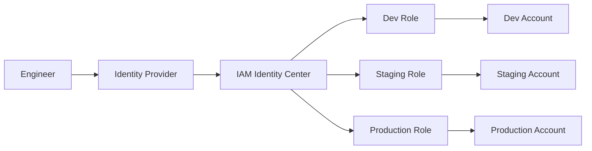

---

# 31. Role Trust

Cross-account role assumption depends on a trust relationship.

Conceptually:

```text
Account A
    |
    | AssumeRole
    v
Account B Role
    |
Trust Policy
```

The target role should trust only the intended principal.

---

# 32. Role Permission Policy

Trust answers:

```text
Who can assume this role?
```

Permissions answer:

```text
What can the role do?
```

These are different controls.

---

# 33. Trust vs Permissions

```text
Trust Policy
     |
     v
Who may assume?
     |
     v
Role Session
     |
     v
Permission Policy
     |
     v
What may it access?
```

A strong engineer should understand both.

---

# 34. CI Cross-Account Deployment

CI should not store permanent AWS access keys.

Preferred conceptual flow:

```text
GitLab CI
    |
OIDC
    |
AWS IAM Role
    |
Temporary Credentials
    |
Target Account
```

This eliminates long-lived CI secrets.

---

# 35. OIDC Deployment Architecture

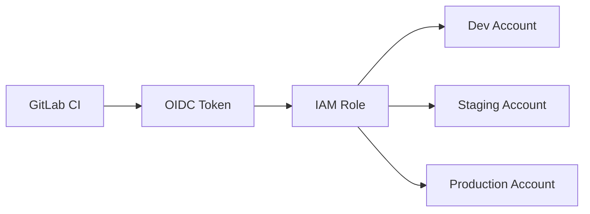

The trust policy should constrain:

```text
Repository
Project
Branch / Tag
Environment
Audience
```

where supported by the identity integration.

---

# 36. Production CI Access

Do not give every CI pipeline:

```text
AdministratorAccess
```

Instead:

```text
Pipeline
 |
Specific Role
 |
Specific Account
 |
Specific Resources
```

Separate:

```text
Infrastructure Role
Application Deployment Role
Read-only Verification Role
```

---

# 37. Terraform Cross-Account Architecture

Terraform may manage multiple accounts.

Conceptually:

```text
Terraform
   |
Provider Configuration
   |
+-- Dev Role
+-- Staging Role
+-- Production Role
+-- Shared Services Role
```

Each provider assumes the correct role.

---

# 38. Terraform State Separation

Do not store all environments in one state file.

Prefer:

```text
state/
|
+-- dev/
|   +-- network.tfstate
|   +-- eks.tfstate
|
+-- staging/
|   +-- network.tfstate
|   +-- eks.tfstate
|
+-- production/
    +-- network.tfstate
    +-- eks.tfstate
```

The physical implementation may use separate buckets/accounts according to governance requirements.

---

# 39. Production Terraform Access

A production Terraform role should be:

```text
Restricted
Audited
CI-controlled
Review-gated
```

Example:

```text
Pull Request
    |
terraform plan
    |
Review
    |
Approval
    |
terraform apply
```

---

# 40. Account-Level Blast Radius

Compare:

```text
Single Account

Compromise
   |
   +--> Dev
   +--> Stage
   +--> Prod
```

with:

```text
Multiple Accounts

Dev Compromise
   |
   X
Prod

Stage Compromise
   |
   X
Prod
```

The second architecture reduces blast radius.

---

# 41. Network Isolation Between Accounts

Accounts can use separate VPCs.

```text
Dev Account
    |
Dev VPC

Staging Account
    |
Staging VPC

Production Account
    |
Production VPC
```

Connectivity should be explicit.

---

# 42. No Default Cross-Account Trust

Do not automatically connect:

```text
Dev <--> Prod
```

If connectivity is required:

```text
Business Requirement
        |
Security Review
        |
Explicit Network Path
        |
Explicit IAM Permission
```

---

# 43. Shared Network Architecture

Organizations may use:

```text
Transit Gateway
```

for controlled network connectivity.

Conceptually:

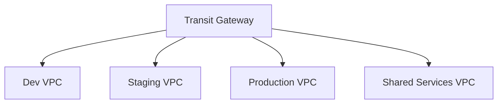

Connectivity must still be restricted using routing and security controls.

---

# 44. Production Network Boundary

Production should have:

```text
Production Account
        |
Production VPC
        |
Private Application
        |
Private Data
```

Do not assume that a VPC alone provides application-level isolation.

Layer:

```text
VPC
Security Groups
NACLs where justified
NetworkPolicy
IAM
Application authentication
```

---

# 45. DNS Strategy

Centralized DNS can be managed through a dedicated architecture.

Example:

```text
Route 53
 |
+-- Public Hosted Zones
|
+-- Private Hosted Zones
|
+-- Cross-account association
```

Production DNS changes should be controlled carefully.

---

# 46. Centralized CloudTrail

Organization-wide auditing:

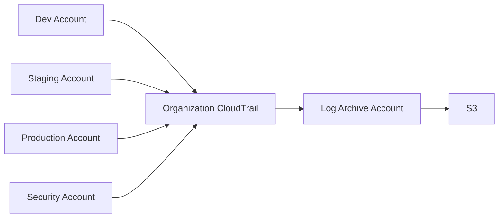

The central archive should be protected from unauthorized modification.

---

# 47. CloudTrail Coverage

Audit important actions such as:

```text
IAM changes
Network changes
Security changes
EKS changes
S3 changes
KMS changes
Database changes
Role assumptions
```

CloudTrail should be part of the organization's baseline governance.

---

# 48. Log Protection

Central log storage should use controls such as:

```text
Encryption
Restricted bucket policy
Versioning where appropriate
Lifecycle policies
Access logging where required
Object Lock where appropriate
```

The exact retention strategy depends on legal, security, and operational requirements.

---

# 49. Security Findings

Security services can feed centralized findings.

```text
AWS Accounts
     |
Security Services
     |
Central Findings
     |
Security Team
     |
Incident Response
```

This allows security teams to detect issues without requiring unrestricted access to application accounts.

---

# 50. GuardDuty Architecture

Conceptual:

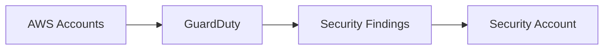

The security account can serve as the centralized security administration boundary.

---

# 51. AWS Config Governance

AWS Config can evaluate resource configuration.

Examples:

```text
Public S3 bucket
Open security group
Unencrypted resource
Missing required tags
Non-compliant configuration
```

Conceptual:

```text
Resource
 |
Config Rule
 |
Compliance Result
 |
Security / Platform Team
```

---

# 52. Tagging Strategy

Every production resource should have standardized metadata.

Example:

```text
Environment=production
Application=roboshop
Team=platform
Owner=devops
CostCenter=engineering
ManagedBy=terraform
Criticality=high
```

Tags support:

```text
Cost allocation
Ownership
Automation
Inventory
Incident response
Governance
```

---

# 53. Mandatory Tags

Potential baseline:

```text
Environment
Application
Owner
Team
ManagedBy
CostCenter
DataClassification
Criticality
```

Avoid excessive mandatory tags that engineers cannot maintain accurately.

---

# 54. Cost Governance

Each account should have visibility into:

```text
Compute
Storage
Network
Database
EKS
Load Balancers
Observability
```

Use:

```text
Budgets
Cost Explorer
Cost allocation tags
Anomaly detection
```

where appropriate.

---

# 55. Account Budget Strategy

Example:

```text
Development
   |
Monthly Budget
   |
Alert at thresholds

Production
   |
Higher budget
   |
Alert on anomaly
```

Budgets should create visibility, not become the only cost-control mechanism.

---

# 56. Production Cost Isolation

Separate production billing visibility makes it easier to answer:

```text
How much does production cost?
```

and:

```text
Which service drives production cost?
```

Without mixing unrelated development experimentation into the same account.

---

# 57. Account Provisioning

New accounts should follow a controlled process.

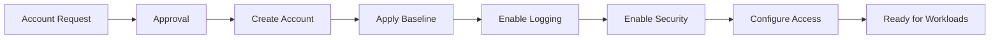

---

# 58. Account Baseline

Every workload account should receive a baseline:

```text
CloudTrail
Security tooling
IAM baseline
Budgets
Tagging
Networking standards
Logging
Guardrails
Backup policies
Monitoring
```

The baseline should be automated as much as practical.

---

# 59. Account Vending

Enterprise organizations often automate account creation.

Conceptual:

```text
Account Request
      |
Account Vending Workflow
      |
AWS Account
      |
Baseline
      |
OU Placement
      |
Security Configuration
      |
Ready
```

This prevents manually configured accounts from drifting.

---

# 60. Production Account Bootstrap

Example sequence:

```text
1. Create account
2. Place into Production OU
3. Apply SCPs
4. Configure identity
5. Configure CloudTrail
6. Configure security services
7. Configure logging
8. Configure budget
9. Configure networking baseline
10. Configure KMS
11. Configure backup
12. Validate baseline
13. Allow workload deployment
```

---

# 61. Break-Glass Access

Production organizations need an emergency access mechanism.

Break-glass means:

```text
Emergency administrative access
```

It should not become normal engineering access.

Example:

```text
Incident
   |
Normal access unavailable
   |
Break-glass approval
   |
Emergency Role
   |
Short-duration operation
   |
Full audit
   |
Access review
```

---

# 62. Break-Glass Requirements

A break-glass process should have:

```text
Strong authentication
Minimal users
Separate credentials/process
Emergency justification
Audit logging
Post-incident review
Credential rotation where applicable
```

---

# 63. Root User Strategy

The AWS root user is extremely privileged.

Use it only for tasks that specifically require root-level access.

Avoid:

```text
Daily engineering
Terraform
CI/CD
kubectl
Application deployment
```

Protect root access with strong authentication and secure recovery mechanisms.

---

# 64. Root Credential Principle

```text
Root
 |
Emergency / account-level operations
 |
Securely controlled
```

Not:

```text
Root
 |
Daily administration
```

---

# 65. Least Privilege

Every access path should answer:

```text
Who?
What?
Where?
When?
Why?
```

Example:

```text
Who:
Production deployment role

What:
Update deployment resources

Where:
Production EKS

When:
Approved deployment

Why:
Application release
```

---

# 66. Privilege Escalation Risk

Avoid policies that allow unrestricted:

```text
iam:*
sts:*
ec2:*
```

without a business requirement.

Especially dangerous combinations include permissions that allow a principal to modify IAM and then assume powerful roles.

---

# 67. IAM Policy Review

Review:

```text
Unused permissions
Wildcard actions
Wildcard resources
Cross-account trust
Role chaining
Admin policies
CI roles
Human roles
Service roles
```

Regular access reviews reduce accumulated privilege.

---

# 68. Environment Promotion

Account separation supports:

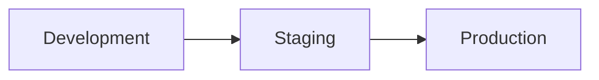

The artifact should remain immutable:

```text
Build Once
      |
      v
Test
      |
      v
Promote
      |
      v
Production
```

Do not rebuild a different binary for production.

---

# 69. Artifact Promotion

```text
Source Commit
     |
CI Build
     |
Image Digest
     |
ECR
     |
Dev
     |
Staging
     |
Production
```

The same immutable artifact should be promoted whenever practical.

---

# 70. ECR Strategy

ECR can be centralized or account-local depending on architecture.

Options:

```text
Option A:
Each account owns its registry

Option B:
Central registry + controlled cross-account access

Option C:
Hybrid
```

The decision should consider:

```text
Security
Network
Promotion
DR
Operational ownership
```

---

# 71. Central Registry Trade-off

Central:

```text
Simpler artifact governance
Central scanning
Central inventory
```

But:

```text
Cross-account dependency
More complex permissions
Potential availability dependency
```

Account-local:

```text
Strong isolation
Simpler account boundary
```

But:

```text
More registries
More replication/governance
```

---

# 72. Secrets Account Strategy

Secrets should normally live close to the workloads that consume them, while using centralized governance where appropriate.

Avoid:

```text
One giant shared secret store
```

with unrestricted cross-account access.

Prefer:

```text
Production Secret
       |
Production Account
       |
Production Workload
```

---

# 73. KMS Strategy

Use KMS to protect:

```text
EBS
S3
Secrets
Databases
Backups
Application data
```

Keys may be:

```text
Account-specific
Shared through controlled grants
Centralized where appropriate
```

Key ownership and recovery requirements must be considered before centralization.

---

# 74. KMS Separation

Example:

```text
Dev
 |
Dev KMS

Staging
 |
Staging KMS

Production
 |
Production KMS
```

This minimizes accidental cross-environment cryptographic access.

---

# 75. Backup Account Strategy

For critical production backups:

```text
Production
     |
     v
Backup
     |
     v
Separate account / vault
```

This reduces the risk of a compromised production account deleting all recovery data.

---

# 76. Backup Isolation

Bad:

```text
Production Account
 |
Production Data
 |
Production Backup
```

Better:

```text
Production Account
 |
Backup Copy
 |
Separate Recovery Boundary
```

The backup boundary should be protected against production compromise.

---

# 77. DR Account vs DR Region

These are different concepts.

```text
DR Region
=
Geographic infrastructure boundary

DR Account
=
AWS account security / governance boundary
```

A robust design can use:

```text
Separate Account
+
Separate Region
```

for stronger isolation.

---

# 78. Example DR Layout

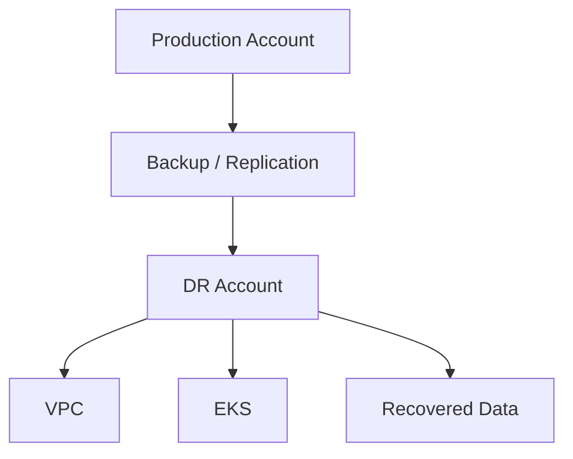

---

# 79. Multi-Account Disaster Scenario

Assume:

```text
Production account compromised
```

Recovery resources remain outside the compromised account:

```text
Production Account
      X
      |
      | compromised
      |
      v
DR Account
      |
      +--> Recovery infrastructure
      +--> Backup data
      +--> Deployment configuration
```

This improves recovery independence.

---

# 80. Account-Level Monitoring

Each account should expose:

```text
Security findings
CloudTrail events
Configuration drift
Cost anomalies
Resource inventory
Service health
```

Central teams can aggregate these signals.

---

# 81. Central Observability vs Account Isolation

Application observability may be centralized while workload ownership remains separated.

Example:

```text
Dev Logs ----+
Stage Logs ---+--> Central Observability
Prod Logs ----+
```

Access controls should ensure:

```text
Developer
   |
Dev Logs

Production Engineer
   |
Production Logs
```

---

# 82. Centralized Security vs Decentralized Operations

Good enterprise model:

```text
Central Security
      |
      +--> Guardrails
      +--> Findings
      +--> Audit
      +--> Standards

Application Teams
      |
      +--> Operate workloads
      +--> Deploy applications
      +--> Respond to incidents
```

Central governance should not require centralizing every operational task.

---

# 83. Ownership Model

Example:

| Area | Owner |
|---|---|
| Organization | Cloud Platform |
| SCPs | Cloud Security |
| IAM baseline | Security/Platform |
| VPC | Platform |
| EKS | Platform |
| Application | Application Team |
| Database | Data/Platform |
| CI | DevOps |
| GitOps | DevOps/Platform |
| Security findings | Security |
| Incident response | On-call + Platform |
| Cost | Engineering + FinOps |

Ownership should be explicitly documented.

---

# 84. RACI Concept

For critical infrastructure define:

```text
Responsible
Accountable
Consulted
Informed
```

Example:

```text
Production EKS

Responsible:
Platform Team

Accountable:
Platform Lead

Consulted:
Security

Informed:
Application Teams
```

---

# 85. Production Access Approval

A controlled model:

```text
Engineer
   |
Access Request
   |
Approval
   |
Permission Assignment
   |
Temporary / Audited Access
```

For high-risk operations:

```text
Two-person approval
```

may be appropriate depending on organizational requirements.

---

# 86. Temporary Elevated Access

Prefer:

```text
Normal Role
     |
Temporary Elevation
     |
Privileged Operation
     |
Automatic Expiration
```

rather than:

```text
Permanent Admin
```

---

# 87. Authentication Requirements

Production access should use:

```text
Strong authentication
Central identity
Role-based access
Session auditing
Device / conditional controls where supported
```

Never rely on shared passwords.

---

# 88. Account Security Baseline

Checklist:

```text
[ ] Root protected
[ ] Strong authentication enabled
[ ] Central identity configured
[ ] CloudTrail enabled
[ ] Security services enabled
[ ] Log archive configured
[ ] SCPs applied
[ ] Budget configured
[ ] Required tags defined
[ ] Backup baseline configured
[ ] IAM roles reviewed
```

---

# 89. Account Separation for Secrets

Consider a compromised developer:

```text
Dev Credential
    |
Can access Dev secrets
    |
Cannot automatically access Prod secrets
```

This is one of the most important benefits of account isolation.

---

# 90. Account Separation for Databases

Production databases should normally remain in production boundaries.

Avoid:

```text
Dev workload
   |
Direct unrestricted access
   |
Production DB
```

If a legitimate integration is required:

```text
Explicit interface
+
Authentication
+
Authorization
+
Network control
+
Audit
```

---

# 91. Account Separation for EKS

Example:

```text
Dev Account
 |
Dev EKS

Staging Account
 |
Staging EKS

Production Account
 |
Production EKS
```

This prevents accidental production changes from ordinary development credentials.

---

# 92. Kubernetes Access Across Accounts

Engineers should receive cluster access through:

```text
Identity
 |
AWS role
 |
EKS access control
 |
Kubernetes RBAC
```

AWS authorization and Kubernetes authorization are separate layers.

---

# 93. EKS Access Model

```text
Engineer
   |
IAM Identity
   |
AWS Role
   |
EKS Access Entry / Authentication
   |
Kubernetes RBAC
   |
Namespace / Resource
```

Do not give every engineer cluster-admin.

---

# 94. Production Kubernetes Roles

Examples:

```text
Developer
   |
Read-only production

DevOps
   |
Operational production access

Platform Admin
   |
Cluster administration

Break Glass
   |
Emergency full access
```

Each should be auditable.

---

# 95. AWS Account + Kubernetes Boundary

The complete security model is:

```text
AWS Organization
       |
AWS Account
       |
VPC
       |
Security Group
       |
EKS
       |
Kubernetes RBAC
       |
Namespace
       |
ServiceAccount
       |
Application
```

Each layer should provide an appropriate control.

---

# 96. Account Strategy and GitOps

GitOps repository should map environments clearly.

Example:

```text
gitops/
|
+-- environments/
|   |
|   +-- dev/
|   +-- staging/
|   +-- production/
|   +-- dr/
|
+-- clusters/
    |
    +-- dev-cluster/
    +-- staging-cluster/
    +-- prod-cluster/
    +-- dr-cluster/
```

Argo CD targets the appropriate account/cluster.

---

# 97. GitOps Access Boundary

Argo CD credentials should not have unrestricted access to every AWS account.

Instead:

```text
Argo CD
 |
Cluster-specific identity
 |
Specific EKS cluster
```

and AWS workload identities should be scoped separately.

---

# 98. Production Deployment Approval

A mature workflow can require:

```text
Code Review
   |
CI
   |
Security
   |
Staging Validation
   |
Production Approval
   |
GitOps Change
   |
Argo CD
```

GitOps does not eliminate change control; it makes changes traceable.

---

# 99. Emergency Deployment

During a critical incident:

```text
Incident
 |
Emergency Change
 |
Approval
 |
Git Change
 |
CI Validation
 |
Argo CD
 |
Production
```

Even emergency changes should leave an audit trail.

---

# 100. No Manual Production Drift

Avoid:

```text
kubectl edit
kubectl set image
Manual Helm upgrade
Manual Terraform changes
```

as normal operational methods.

Preferred:

```text
Git
 |
Review
 |
Automation
 |
Deployment
```

Emergency break-glass procedures may temporarily bypass normal paths, but the desired state should subsequently be reconciled into Git.

---

# 101. Drift Detection

Drift can occur at multiple levels:

```text
AWS Drift
 |
Terraform

Kubernetes Drift
 |
Argo CD

Configuration Drift
 |
AWS Config

Security Drift
 |
Security Services
```

Each control plane should detect its relevant class of drift.

---

# 102. Account-Level Failure Scenarios

Test:

```text
Compromised developer role
Production role misuse
SCP misconfiguration
CloudTrail failure
Central log failure
Cross-account trust error
OIDC trust error
KMS permission error
Backup account access failure
DR account deployment failure
```

---

# 103. SCP Failure Scenario

Suppose a production SCP accidentally denies:

```text
ec2:Describe*
```

Result:

```text
Terraform / tooling
       |
       v
Unexpected failure
```

Therefore:

```text
Test SCPs
Use staged rollout
Monitor
Have rollback procedure
```

---

# 104. Cross-Account Role Failure

Symptoms:

```text
AccessDenied
AssumeRole failed
Invalid principal
Trust policy mismatch
```

Troubleshooting:

```text
1. Check source identity
2. Check target role ARN
3. Check trust policy
4. Check source permission
5. Check SCP
6. Check session conditions
7. Check external ID / audience where relevant
8. Check CloudTrail
```

---

# 105. CI OIDC Failure

Typical causes:

```text
Wrong audience
Wrong issuer
Wrong subject condition
Wrong role ARN
Wrong branch condition
Missing trust relationship
SCP denial
```

Debug:

```text
GitLab job
 |
OIDC token
 |
IAM trust
 |
STS AssumeRoleWithWebIdentity
 |
Temporary credentials
```

---

# 106. Production Account Compromise Response

If production is compromised:

```text
1. Declare incident
2. Restrict compromised access
3. Preserve logs
4. Identify affected roles
5. Rotate/revoke credentials where required
6. Isolate affected workloads
7. Validate backup integrity
8. Assess DR
9. Recover
10. Perform forensic analysis
11. Remediate root cause
```

Do not immediately destroy evidence.

---

# 107. Log Archive During Compromise

The separate log archive provides:

```text
Independent evidence
```

which can help determine:

```text
Who
What
When
From where
Which role
Which API calls
```

This is a major reason for centralized audit logging.

---

# 108. Production Account Deletion Protection

Production accounts should not be casually deleted.

Controls may include:

```text
Restricted account management
SCP guardrails
Organizational approval
Break-glass process
Backup retention
```

Account lifecycle itself should be governed.

---

# 109. Environment Naming

Use predictable naming.

Example:

```text
company-dev
company-staging
company-prod
company-dr
company-security
company-log-archive
company-shared
```

Avoid ambiguous names such as:

```text
test2
newprod
finalprod
temp
```

---

# 110. Resource Naming

Consistent naming helps operations.

Example:

```text
prod-ap-south-1-vpc
prod-eks-main
prod-alb
prod-app-private-a
```

Do not make names so long that they become unusable.

---

# 111. Account Metadata

Maintain an account inventory:

```text
Account ID
Account Name
OU
Environment
Owner
Purpose
Region
Security Contact
Cost Center
Lifecycle
DR Role
```

The inventory should be authoritative.

---

# 112. Account Lifecycle

```text
Requested
   |
Approved
   |
Created
   |
Baselined
   |
Active
   |
Decommission Requested
   |
Data Retained
   |
Resources Removed
   |
Closed
```

Decommissioning should be as controlled as creation.

---

# 113. Decommissioning

Before deleting an account:

```text
[ ] Data retention checked
[ ] Backups retained
[ ] DNS removed
[ ] IAM reviewed
[ ] Secrets handled
[ ] Logs retained
[ ] Cost impact checked
[ ] Dependencies removed
[ ] Security approval
```

---

# 114. Account Strategy and Compliance

Separate accounts can support:

```text
Data isolation
Audit boundaries
Access separation
Retention controls
Regional restrictions
Security monitoring
```

But account separation alone does not guarantee compliance.

Compliance depends on the complete control environment.

---

# 115. Account Strategy and Zero Trust

Zero Trust principles fit naturally:

```text
Never trust by network alone
Verify identity
Authorize explicitly
Limit access
Continuously monitor
```

Account boundaries strengthen this model.

---

# 116. Defense in Depth

Production protection should look like:

```text
Organization
   |
SCP
   |
IAM
   |
Account
   |
VPC
   |
Security Group
   |
EKS
   |
NetworkPolicy
   |
RBAC
   |
Application Auth
```

No single control should be considered sufficient.

---

# 117. Central vs Local Governance

Central:

```text
Organization
Security
Audit
Guardrails
Standards
```

Local:

```text
Application deployment
Workload operations
Service configuration
Team-specific scaling
```

This balances control with engineering autonomy.

---

# 118. Platform Team Responsibilities

The platform team may own:

```text
AWS accounts
VPC
EKS
Terraform modules
IAM baseline
Argo CD
Observability platform
Security integration
Backup
DR platform
```

Application teams consume the platform through standardized interfaces.

---

# 119. Platform as a Product

The platform should provide:

```text
Golden paths
Templates
Modules
Documentation
Self-service
Guardrails
Observability
Support
```

Instead of requiring application teams to reinvent infrastructure.

---

# 120. Account Strategy Golden Path

New application:

```text
Application Request
       |
Development Account
       |
Terraform
       |
VPC
       |
EKS
       |
CI
       |
ECR
       |
GitOps
       |
Argo CD
       |
Staging
       |
Production
```

This creates a repeatable delivery model.

---

# 121. Enterprise Reference Architecture

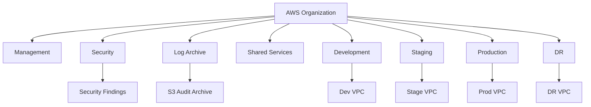

---

# 122. Complete Identity Flow

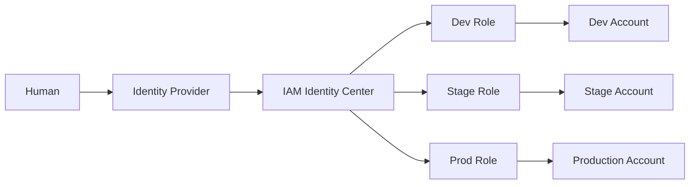

---

# 123. Complete CI Identity Flow

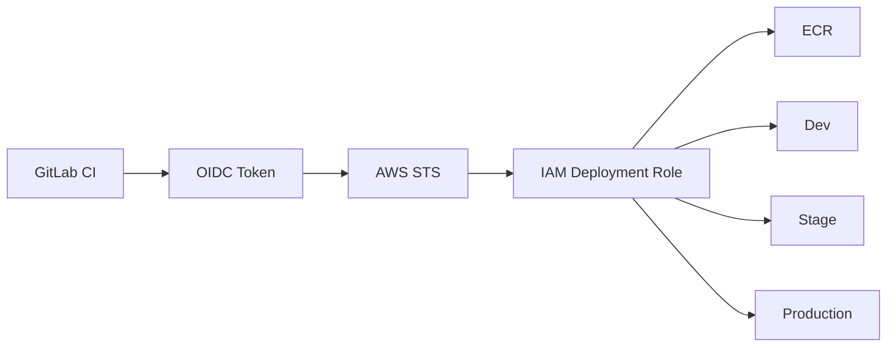

Separate deployment roles should be used for each environment.

---

# 124. Complete Audit Flow

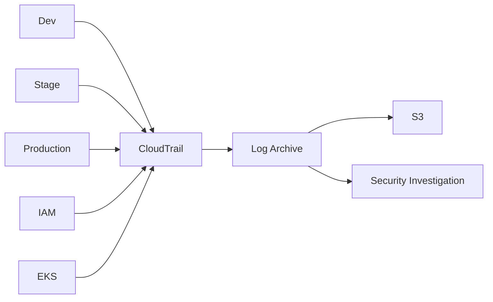

---

# 125. Complete Security Flow

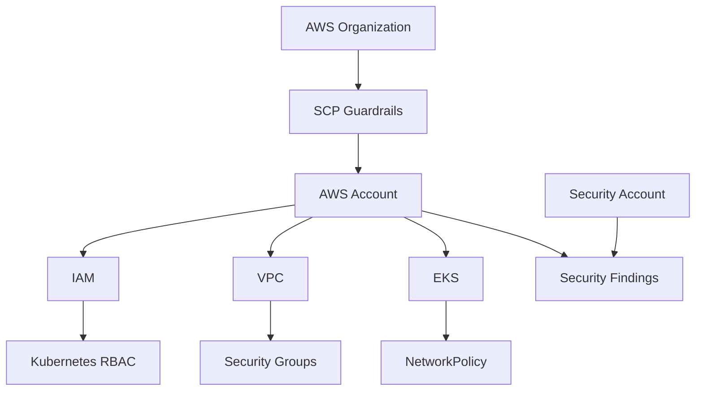

---

# 126. Complete Production Governance

```text
AWS Organization
       |
Production OU
       |
Production Account
       |
SCP
       |
IAM Identity
       |
Production Role
       |
VPC
       |
EKS
       |
Kubernetes RBAC
       |
Namespace
       |
Application
```

This is the complete layered authorization model.

---

# 127. Recommended Capstone Account Model

For this capstone, use:

```text
1. Management
2. Security
3. Log Archive
4. Shared Services
5. Development
6. Staging
7. Production
8. DR
```

If the actual AWS budget does not permit all accounts:

```text
Use the same logical architecture
but reduce the physical account count.
```

The important learning objective is understanding the boundaries.

---

# 128. Cost-Conscious Capstone Variant

A smaller practical setup can use:

```text
Management
Security
NonProduction
Production
```

with logical environments:

```text
NonProduction
 |
Dev
 |
Staging
```

This reduces cost while preserving the core multi-account concept.

---

# 129. Interview Answer — Why Multiple Accounts?

Strong answer:

```text
I use AWS accounts as security and operational boundaries.
Development, staging, and production are isolated so that a
compromise or accidental change in a lower environment does not
automatically affect production. Security and audit functions are
also separated into dedicated accounts. This gives us stronger
blast-radius control, centralized governance, independent logging,
clear billing visibility, and controlled cross-account access.
```

---

# 130. Interview Answer — Why Separate Log Archive?

```text
I don't want production administrators to have unrestricted ability
to modify the audit trail. I centralize organization-level audit logs
into a dedicated log archive account with restricted access. This
improves forensic integrity and allows security teams to investigate
activity independently from workload administrators.
```

---

# 131. Interview Answer — What Does SCP Do?

```text
An SCP is an organization-level permission boundary. It does not grant
permissions by itself. It defines the maximum permissions available
to accounts or organizational units. For example, I can use an SCP to
prevent production accounts from disabling critical governance controls
or using unapproved regions.
```

---

# 132. Interview Answer — How Does CI Access AWS?

```text
I avoid long-lived AWS access keys in CI. I use OIDC federation so
the CI system obtains a short-lived identity token and assumes a
specific IAM role. The role is restricted to the target environment
and required actions. Production deployment permissions are separated
from development permissions.
```

---

# 133. Interview Answer — How Do You Protect Production?

```text
I use multiple layers: a dedicated production account, production OU
guardrails, centralized identity, least-privilege IAM, private
networking, security groups, Kubernetes RBAC, NetworkPolicies,
externalized secrets, encryption, centralized auditing, controlled
CI/CD access, GitOps, monitoring, backups, and tested disaster
recovery.
```

---

# 134. Interview Answer — What Happens If Production Is Compromised?

```text
First I declare and contain the incident. I restrict compromised
identities, preserve audit evidence, determine the blast radius,
and investigate CloudTrail and security findings. I validate backup
integrity and determine whether recovery or DR is required. After
service restoration I rotate affected credentials, remediate the
root cause, and perform a post-incident review.
```

---

# 135. Production Account Checklist

```text
Organization
[ ] Correct OU
[ ] SCP applied
[ ] Account owner assigned

Identity
[ ] IAM Identity Center
[ ] Permission sets
[ ] Production roles
[ ] Break-glass process

Security
[ ] GuardDuty
[ ] Security Hub
[ ] Inspector where applicable
[ ] Config where applicable
[ ] Access Analyzer

Audit
[ ] Organization CloudTrail
[ ] Central log archive
[ ] Retention policy

Networking
[ ] VPC
[ ] Private subnets
[ ] Routing
[ ] Security groups
[ ] DNS

Data
[ ] KMS
[ ] Secrets
[ ] Backup
[ ] DR

Cost
[ ] Budget
[ ] Tags
[ ] Cost visibility
```

---

# 136. Account Strategy Anti-Patterns

Avoid:

```text
One AWS account for everything
Production workloads in management account
Shared root credentials
Long-lived CI access keys
Permanent admin access
No central audit logs
No SCP guardrails
Unrestricted cross-account trust
Production secrets in Dev
Shared production database with Dev
No backup isolation
No DR account strategy
No account inventory
No cost ownership
Manual account configuration
```

---

# 137. Account Governance Lifecycle

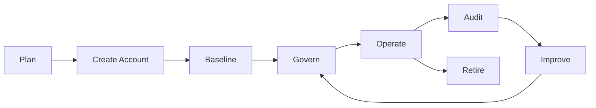

---

# 138. Final Architecture

```text
                         AWS ORGANIZATION
                                |
        +-----------------------+-----------------------+
        |                       |                       |
    GOVERNANCE               SECURITY               WORKLOADS
        |                       |                       |
   Management             Security Account       NonProduction
   SCPs                   Log Archive             Production
   Billing                Findings                DR
                                |
                         Central Audit
```

---

# 139. Final Production Boundary

```text
                         INTERNET
                             |
                           Route53
                             |
                            WAF
                             |
                            ALB
                             |
                    Production Account
                             |
                            VPC
                             |
                            EKS
                             |
                  Kubernetes Authorization
                             |
                       Applications
                             |
             +---------------+---------------+
             |               |               |
            DB             Redis           Broker
```

Access into this environment should be explicitly authorized.

---

# 140. Final CI/CD Boundary

```text
Developer
    |
Git
    |
CI
    |
OIDC
    |
Temporary AWS Role
    |
ECR
    |
GitOps
    |
Argo CD
    |
Production EKS
```

There should be no requirement for developers to possess permanent production credentials.

---

# 141. Final Security Boundary

```text
                AWS Organization
                       |
                      SCP
                       |
                AWS Account
                       |
                      IAM
                       |
                      VPC
                       |
                Security Group
                       |
                     EKS
                       |
                 Kubernetes RBAC
                       |
                NetworkPolicy
                       |
                  Application
```

Defense in depth is the goal.

---

# 142. Final Recovery Boundary

```text
Production Account
       |
       +-------> Backup
       |
       +-------> Log Archive
       |
       +-------> DR Account
                    |
                    +--> DR Region
                    |
                    +--> Recovery EKS
                    |
                    +--> Recovery Data
```

Recovery infrastructure must not depend entirely on the health of the compromised production account.

---

# 143. Final Mental Model

Memorize:

```text
ACCOUNT = SECURITY + BLAST RADIUS + BILLING + GOVERNANCE BOUNDARY

OU = POLICY / GOVERNANCE GROUP

SCP = MAXIMUM PERMISSION GUARDRAIL

IAM ROLE = WHO MAY DO WHAT

TRUST POLICY = WHO MAY ASSUME THE ROLE

CLOUDTRAIL = WHAT HAPPENED

LOG ARCHIVE = INDEPENDENT AUDIT STORAGE

OIDC = SHORT-LIVED CI IDENTITY

PRODUCTION ACCOUNT = STRONGEST WORKLOAD BOUNDARY

DR ACCOUNT = RECOVERY ISOLATION

TAGS = OWNERSHIP + COST + GOVERNANCE
```

---

# 144. What This Enables in the Capstone

This account strategy becomes the foundation for the next documents:

```text
04 AWS Account Strategy
        |
        v
05 AWS VPC Architecture
        |
        v
06 Terraform Infrastructure
        |
        v
07 EKS Cluster Architecture
        |
        v
08 ECR
        |
        v
09 Kubernetes Platform
        |
        v
10 Helm
        |
        v
11 CI
        |
        v
12 DevSecOps
        |
        v
13 GitOps
        |
        v
14 Argo CD
```

The architecture should remain consistent across all later files.

---

# 145. Final Validation

Before moving to VPC implementation:

```text
[ ] Account boundaries defined
[ ] Production isolated
[ ] DR boundary defined
[ ] Security account defined
[ ] Log archive defined
[ ] Shared services justified
[ ] OUs defined
[ ] SCP strategy defined
[ ] Human identity strategy defined
[ ] Cross-account role strategy defined
[ ] CI OIDC strategy defined
[ ] Terraform role strategy defined
[ ] EKS access strategy defined
[ ] CloudTrail strategy defined
[ ] Security tooling defined
[ ] Backup isolation defined
[ ] Cost governance defined
[ ] Tagging strategy defined
[ ] Break-glass process defined
[ ] Account lifecycle defined
```

---

# 146. Next Document

```text
05-AWS-VPC-Architecture.md
```

The next document will define the production network in depth:

```text
VPC CIDR planning
Availability Zones
Public subnets
Private application subnets
Private data subnets
Route tables
Internet Gateway
NAT Gateway
VPC endpoints
Security groups
Network ACLs
DNS
DHCP
EKS networking
Load balancers
Transit Gateway
VPC peering
Cross-account connectivity
Network segmentation
Flow Logs
IPv4 / IPv6 considerations
High availability
NAT failure scenarios
Network troubleshooting
Production Terraform structure
```

It will become the networking foundation for the EKS and Terraform implementation.

---
