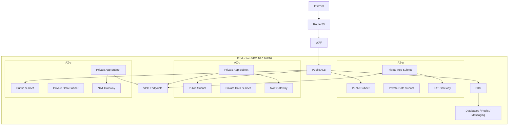

# AWS VPC Architecture

## 1. Purpose

This document defines the production-grade AWS networking architecture for the DevOps Production Capstone.

The VPC is the network foundation for:

- EKS
- ALB
- Application workloads
- Databases
- Redis
- RabbitMQ/Kafka
- Monitoring
- Logging
- CI/CD integrations
- Private AWS service access
- Cross-account connectivity
- Disaster recovery

The design must provide:

```text
High Availability
Security
Isolation
Scalability
Observability
Controlled Internet Access
Private AWS Service Access
Predictable Routing
Operational Simplicity
```

---

# 2. Target Architecture

```text
                         INTERNET
                            |
                        Route 53
                            |
                           WAF
                            |
                     Internet Gateway
                            |
                    +-------+-------+
                    |               |
                 Public           Public
                Subnet-A         Subnet-B
                    |               |
                   ALB             ALB
                    |               |
                    +-------+-------+
                            |
                    Private App Subnets
                    |       |       |
                   EKS     EKS     EKS
                    |       |       |
                    +-------+-------+
                            |
                    Private Data Subnets
                    |       |       |
                   DB      Redis   Broker
```

---

# 3. Why a VPC?

A VPC provides an isolated logical network boundary.

It allows us to define:

```text
CIDR
Subnets
Routing
Security Groups
Network ACLs
Internet connectivity
Private connectivity
DNS
Flow Logs
```

For a production platform, the VPC is one of the most important infrastructure layers.

---

# 4. Production Network Principles

Use these principles:

```text
1. Design for multiple Availability Zones.
2. Keep application workloads private.
3. Expose only required entry points.
4. Minimize public IP addresses.
5. Prefer private AWS service connectivity.
6. Use security groups as the primary workload firewall.
7. Keep data services isolated.
8. Make routing explicit.
9. Enable network observability.
10. Automate infrastructure with Terraform.
```

---

# 5. Availability Zones

A production VPC should span multiple Availability Zones.

Example:

```text
Region: ap-south-1

AZ-a
AZ-b
AZ-c
```

Architecture:

```text
                    VPC
                     |
        +------------+------------+
        |            |            |
       AZ-a         AZ-b         AZ-c
```

This protects against a single-AZ failure.

---

# 6. Why Three AZs?

Two AZs can provide high availability.

Three AZs provide:

```text
Better failure tolerance
Better EKS scheduling
Better load distribution
More resilient NAT strategy
More balanced capacity
```

For a serious production architecture, three AZs are a strong default when service support and cost justify it.

---

# 7. VPC CIDR Planning

Example:

```text
VPC CIDR:

10.0.0.0/16
```

This provides:

```text
65,536 IPv4 addresses
```

The CIDR should be selected after considering:

```text
Current workload
Future growth
EKS Pod IP requirements
VPC peering
Transit Gateway
On-premises networks
Other AWS VPCs
DR networks
```

Do not select a CIDR without considering future connectivity.

---

# 8. CIDR Overlap

Bad:

```text
Production VPC:
10.0.0.0/16

Another VPC:
10.0.0.0/16
```

Overlapping CIDRs complicate:

```text
VPC Peering
Transit Gateway
VPN
Direct Connect
Routing
```

Plan organization-wide CIDR ranges.

---

# 9. Enterprise CIDR Example

```text
10.0.0.0/8
|
+-- 10.0.0.0/16      Production
+-- 10.1.0.0/16      Staging
+-- 10.2.0.0/16      Development
+-- 10.3.0.0/16      DR
+-- 10.4.0.0/16      Shared Services
```

This is only an example.

Actual ranges depend on enterprise networking requirements.

---

# 10. Subnet Architecture

Use logical subnet tiers:

```text
Public
Private Application
Private Data
```

Example:

```text
VPC 10.0.0.0/16

Public:
10.0.0.0/20
10.0.16.0/20
10.0.32.0/20

Private App:
10.0.64.0/20
10.0.80.0/20
10.0.96.0/20

Private Data:
10.0.128.0/20
10.0.144.0/20
10.0.160.0/20
```

---

# 11. Subnet-to-AZ Mapping

```text
AZ-a
 |
 +-- Public-A
 +-- Private-App-A
 +-- Private-Data-A

AZ-b
 |
 +-- Public-B
 +-- Private-App-B
 +-- Private-Data-B

AZ-c
 |
 +-- Public-C
 +-- Private-App-C
 +-- Private-Data-C
```

---

# 12. Public Subnets

Public subnets normally contain resources that need public-facing connectivity.

Typical:

```text
Application Load Balancer
NAT Gateway
```

A subnet is considered public because its route table has a route to an Internet Gateway.

Example:

```text
0.0.0.0/0
     |
Internet Gateway
```

---

# 13. Private Application Subnets

Application subnets should normally not have direct inbound Internet connectivity.

They may contain:

```text
EKS worker nodes
Pods
Internal services
Application workloads
Internal load balancers
```

Outbound Internet access can be provided through NAT where required.

---

# 14. Private Data Subnets

Data services should be isolated further.

Examples:

```text
RDS
ElastiCache
Amazon MQ
Self-managed brokers
Internal databases
```

Data subnets should not need direct Internet access.

---

# 15. Three-Tier Network

```text
                    INTERNET
                       |
                      ALB
                       |
                PUBLIC SUBNETS
                       |
                       v
             PRIVATE APP SUBNETS
                       |
                       v
             PRIVATE DATA SUBNETS
```

This is the baseline segmentation.

---

# 16. Internet Gateway

The Internet Gateway provides VPC-level Internet connectivity.

Conceptually:

```text
Public Subnet
     |
Route Table
     |
0.0.0.0/0
     |
Internet Gateway
     |
Internet
```

The IGW is horizontally scaled and managed by AWS.

---

# 17. NAT Gateway

Private resources may need outbound Internet access.

Example:

```text
Private EKS Node
      |
Route Table
      |
NAT Gateway
      |
Internet Gateway
      |
Internet
```

NAT allows outbound connections without making the private resource directly reachable from the Internet.

---

# 18. NAT Gateway Placement

NAT Gateways should be placed in public subnets.

Example:

```text
AZ-a
Public-A
  |
NAT-A

AZ-b
Public-B
  |
NAT-B

AZ-c
Public-C
  |
NAT-C
```

---

# 19. One NAT vs NAT per AZ

Single NAT:

```text
Private-A
Private-B
Private-C
     |
     v
   NAT-A
```

Problem:

```text
AZ-a NAT failure
     |
All AZs potentially affected
```

Production architecture:

```text
Private-A --> NAT-A
Private-B --> NAT-B
Private-C --> NAT-C
```

This improves AZ isolation.

---

# 20. NAT Trade-off

NAT Gateway provides resilience but costs money.

Cost drivers include:

```text
Hourly NAT charge
Data processing
Cross-AZ traffic
Internet traffic
```

Avoid unnecessary cross-AZ NAT traffic.

---

# 21. Route Tables

Each subnet should have the correct route table.

Example public:

```text
10.0.0.0/16 --> local
0.0.0.0/0   --> IGW
```

Private:

```text
10.0.0.0/16 --> local
0.0.0.0/0   --> NAT-A
```

Data:

```text
10.0.0.0/16 --> local
```

plus required private endpoints/routes.

---

# 22. Local Route

Every VPC route table includes local routing for the VPC CIDR.

Example:

```text
10.0.0.0/16 --> local
```

This enables communication between subnets subject to security controls.

---

# 23. Public Route Table

```text
Destination       Target

10.0.0.0/16       local
0.0.0.0/0         igw-xxxx
```

Associate it only with intended public subnets.

---

# 24. Private Route Table

```text
Destination       Target

10.0.0.0/16       local
0.0.0.0/0         nat-xxxx
```

Use separate route tables per AZ where required.

---

# 25. Data Route Table

Prefer minimal routes.

```text
10.0.0.0/16       local
```

Then add only required private service routes.

The principle:

```text
Data subnet should have the smallest practical network path.
```

---

# 26. VPC Endpoints

VPC endpoints allow private connectivity to supported AWS services.

This can reduce:

```text
NAT dependency
Internet exposure
NAT processing cost
Network latency
```

Examples:

```text
S3
DynamoDB
ECR
CloudWatch
STS
Secrets Manager
KMS
SSM
EC2
```

Exact endpoint requirements depend on the workload.

---

# 27. Gateway Endpoints

Gateway endpoints commonly support:

```text
S3
DynamoDB
```

They are associated with route tables.

Example:

```text
Private Subnet
      |
Route Table
      |
S3 Prefix
      |
Gateway Endpoint
      |
S3
```

---

# 28. Interface Endpoints

Interface endpoints use ENIs inside subnets.

Examples:

```text
ECR API
ECR DKR
CloudWatch
STS
Secrets Manager
KMS
SSM
```

Conceptually:

```text
Private Subnet
     |
Endpoint ENI
     |
PrivateLink
     |
AWS Service
```

---

# 29. EKS and VPC Endpoints

EKS workloads often require access to:

```text
ECR
STS
S3
CloudWatch
Secrets Manager
KMS
```

Private endpoints can reduce NAT traffic.

A production platform should explicitly evaluate endpoint requirements instead of blindly routing all traffic through NAT.

---

# 30. ECR Private Access

An EKS node pulling an image:

```text
EKS Node
   |
ECR API / Registry
   |
Private Endpoint
```

This can avoid Internet/NAT dependency when the required endpoints and supporting configuration are present.

---

# 31. S3 Private Access

Application:

```text
EKS Pod
   |
S3
```

Preferred path where appropriate:

```text
EKS Pod
   |
VPC Endpoint
   |
S3
```

instead of:

```text
EKS Pod
   |
NAT
   |
Internet
   |
S3
```

---

# 32. DNS

Enable VPC DNS support.

Important concepts:

```text
enableDnsSupport
enableDnsHostnames
```

These support service discovery and private AWS endpoint resolution.

---

# 33. Route 53

Use Route 53 for DNS.

Example:

```text
www.example.com
        |
Route 53
        |
ALB
```

Internal:

```text
api.internal.example.com
        |
Private Hosted Zone
        |
Internal Load Balancer
```

---

# 34. Public DNS Architecture

```text
Internet
   |
Route 53 Public Hosted Zone
   |
ALB
   |
EKS Ingress
```

The ALB remains the public entry point.

---

# 35. Private DNS Architecture

```text
Application
    |
api.internal.example.com
    |
Route 53 Private Hosted Zone
    |
Internal ALB
    |
Service
```

Use private DNS for internal communication where appropriate.

---

# 36. Security Groups

Security Groups are stateful virtual firewalls.

They control:

```text
Inbound
Outbound
```

at the ENI level.

---

# 37. Stateful Behavior

If inbound traffic is allowed:

```text
Client --> Server
```

the response traffic is automatically allowed by the stateful security group.

This differs from stateless NACL behavior.

---

# 38. Security Group Design

Avoid one huge security group:

```text
allow-all-production
```

Prefer purpose-based groups:

```text
alb-sg
eks-node-sg
app-sg
database-sg
redis-sg
broker-sg
```

---

# 39. ALB Security Group

Example:

```text
Inbound:
443 from Internet / approved sources

Outbound:
Application port to application targets
```

Avoid:

```text
0.0.0.0/0
all ports
```

unless genuinely required.

---

# 40. Application Security Group

Example:

```text
Inbound:
8080 from ALB security group

Outbound:
Required database/broker/service destinations
```

This creates identity-like network authorization:

```text
ALB SG
   |
   v
App SG
```

---

# 41. Database Security Group

Example:

```text
Inbound:
5432 from App SG
```

Not:

```text
5432 from 0.0.0.0/0
```

The database should trust only the required application layer.

---

# 42. Redis Security Group

Example:

```text
6379
from
App SG
```

If multiple applications use Redis, define access deliberately.

---

# 43. RabbitMQ Security Group

Common ports:

```text
5672  AMQP
5671  AMQPS
15672 Management UI
```

Only expose required ports.

Management UI should not normally be Internet-public.

---

# 44. Kafka Security Group

Typical ports depend on deployment configuration.

Example:

```text
9092
9093
9094
```

Use the actual listener/security configuration rather than assuming one fixed port.

Keep broker access private.

---

# 45. Security Group Chaining

Strong pattern:

```text
Internet
   |
ALB-SG
   |
App-SG
   |
DB-SG
```

Rules reference security groups rather than broad CIDRs where practical.

---

# 46. Network ACLs

NACLs operate at subnet level.

They are:

```text
Stateless
Ordered
Subnet-level
```

Every allowed connection generally requires appropriate inbound and outbound rules.

---

# 47. Security Group vs NACL

| Feature | Security Group | NACL |
|---|---|---|
| Scope | ENI/resource | Subnet |
| Stateful | Yes | No |
| Rules | Allow | Allow/Deny |
| Ordering | No priority model like NACL | Ordered |
| Typical use | Primary workload firewall | Coarse subnet control |

---

# 48. NACL Strategy

Do not make NACLs unnecessarily complex.

A common strategy:

```text
Security Groups
+
Simple NACL baseline
```

Use explicit deny rules when there is a clear requirement.

---

# 49. EKS Networking

EKS networking must be planned around:

```text
Nodes
Pods
Services
Load Balancers
IP consumption
Security groups
Routes
```

AWS VPC CNI assigns VPC networking to pods.

Therefore pod IP consumption can become a major CIDR planning concern.

---

# 50. EKS Subnets

Example:

```text
EKS
 |
+-- Private-App-A
+-- Private-App-B
+-- Private-App-C
```

Nodes normally live in private subnets in this production architecture.

---

# 51. Pod IP Capacity

Suppose:

```text
3 AZs
10 nodes per AZ
Each node needs many pod IPs
```

Subnet sizing must account for:

```text
Node ENIs
Pod IPs
AWS reserved addresses
Scaling
DaemonSets
Rolling deployments
Cluster growth
```

Do not size subnets only for today's nodes.

---

# 52. Prefix Delegation

AWS VPC CNI supports prefix delegation in appropriate configurations.

It can improve IP allocation efficiency and pod density.

The exact setting should be tested against:

```text
Instance type
CNI version
IP family
Pod density
Subnet capacity
```

---

# 53. Secondary CIDR

If the primary VPC CIDR becomes insufficient, secondary CIDRs can extend the address space.

Conceptually:

```text
VPC
 |
+-- Primary CIDR
|
+-- Secondary CIDR
```

However, this should be planned carefully because networking complexity increases.

---

# 54. IPv4 vs IPv6

Production design should consciously choose:

```text
IPv4
Dual-stack
IPv6-focused
```

IPv4 remains common for enterprise compatibility.

IPv6 can provide a large address space but introduces operational requirements.

Do not add IPv6 merely because it is available.

---

# 55. Load Balancer Architecture

Public application:

```text
Internet
   |
ALB
   |
EKS Ingress
   |
Service
   |
Pods
```

Internal application:

```text
Internal Client
   |
Internal ALB/NLB
   |
EKS Service
```

---

# 56. ALB Placement

The ALB is associated with subnets across multiple AZs.

Example:

```text
ALB
 |
+-- Public-A
+-- Public-B
+-- Public-C
```

This provides AZ-level resilience.

---

# 57. Ingress Architecture

```text
Route 53
   |
ALB
   |
Ingress Controller
   |
Kubernetes Service
   |
Pods
```

The exact controller implementation can be AWS Load Balancer Controller.

---

# 58. Internal vs External ALB

External:

```text
Internet --> ALB
```

Internal:

```text
VPC --> Internal ALB
```

Choose based on traffic requirements.

Do not make an internal application public just for convenience.

---

# 59. Egress Architecture

Private workloads may need:

```text
OS package downloads
Container registries
External APIs
AWS APIs
Security updates
```

Use:

```text
VPC Endpoints
+
NAT Gateway
```

as appropriate.

---

# 60. Egress Restriction

Do not assume private subnet equals unrestricted outbound security.

Control:

```text
Security Groups
Network Firewall where justified
DNS filtering where justified
Proxy where justified
Endpoint policies
Application-level allowlists
```

The required control level depends on risk.

---

# 61. AWS Network Firewall

For highly controlled environments:

```text
Private Subnet
     |
Network Firewall
     |
Egress
```

It can provide centralized inspection.

However, it adds:

```text
Cost
Complexity
Routing requirements
Operational overhead
```

Use it when requirements justify it.

---

# 62. VPC Flow Logs

Enable Flow Logs for network visibility.

They can help answer:

```text
Who communicated?
Where?
On which port?
Accepted or rejected?
```

Example:

```text
Source
Destination
Port
Protocol
Action
Bytes
Packets
```

---

# 63. Flow Log Destination

Possible destinations include:

```text
CloudWatch Logs
S3
Kinesis Firehose
```

Choose based on:

```text
Search
Retention
Cost
Integration
Security
```

---

# 64. Flow Logs and Troubleshooting

Scenario:

```text
Application --> Database
```

Application receives:

```text
Connection timeout
```

Check:

```text
DNS
Route
Security Group
NACL
Flow Logs
Database listener
Application configuration
```

Flow Logs can distinguish network-level rejection from application-level failure.

---

# 65. VPC Reachability Analyzer

Reachability analysis can help validate whether a network path exists.

Conceptually:

```text
Source ENI
    |
Reachability Analyzer
    |
Destination ENI
```

It can help identify:

```text
Missing route
Blocked security group
Network ACL issue
Unsupported path
```

---

# 66. Network Troubleshooting Order

When traffic fails:

```text
1. DNS
2. Source IP
3. Destination IP
4. Route table
5. Security Group
6. NACL
7. NAT / IGW / Endpoint
8. Load Balancer
9. Application listener
10. Kubernetes Service
11. Pod
```

Avoid changing random firewall rules before establishing where traffic stops.

---

# 67. DNS Troubleshooting

Check:

```bash
nslookup example.com
dig example.com
```

For internal services:

```bash
nslookup api.internal.example.com
```

Inside a pod:

```bash
kubectl exec -it <pod> -- nslookup <service>
```

DNS failure can look like an application connectivity failure.

---

# 68. Route Troubleshooting

Verify:

```text
Source subnet route table
Destination CIDR
Target
Return route
```

Remember:

```text
Forward path
+
Return path
```

Both matter.

---

# 69. Security Group Troubleshooting

Ask:

```text
What is the source ENI/security group?
What is the destination ENI/security group?
What port?
Which protocol?
Is the inbound rule present?
Is outbound traffic allowed?
```

Do not assume the pod and node security identity are always the same.

---

# 70. NACL Troubleshooting

Because NACLs are stateless, verify:

```text
Inbound rule
Outbound rule
Ephemeral ports
Rule order
Subnet association
```

An incorrect NACL can break otherwise correct security groups.

---

# 71. NAT Troubleshooting

Symptoms:

```text
Private pods cannot reach Internet
Package downloads fail
External API calls timeout
Image pulls fail
```

Check:

```text
Private route table
NAT Gateway
Public route table
Internet Gateway
NAT subnet
NAT state
Security Group
NACL
```

---

# 72. NAT High Availability Failure

Scenario:

```text
AZ-a NAT fails
```

If all private subnets use NAT-A:

```text
Multiple AZ workloads lose egress
```

With per-AZ NAT:

```text
Private-A --> NAT-A
Private-B --> NAT-B
Private-C --> NAT-C
```

the failure remains more localized.

---

# 73. VPC Endpoint Failure

If EKS relies heavily on endpoints:

```text
Endpoint misconfiguration
      |
AWS API access fails
```

Check:

```text
Endpoint exists
Correct subnet
Correct route / DNS
Endpoint SG
Endpoint policy
Private DNS
```

---

# 74. Endpoint Security Group

Interface endpoints use security groups.

Example:

```text
Endpoint-SG
Inbound:
443 from EKS node/pod security group
```

Do not expose endpoint ENIs broadly.

---

# 75. Endpoint Policy

For supported gateway/interface services, endpoint policies can further restrict access.

Example concept:

```text
Only approved S3 buckets
```

This creates an additional boundary beyond IAM.

---

# 76. EKS Control Plane Networking

EKS control-plane networking is managed by AWS.

You still need to understand:

```text
Cluster endpoint
Private endpoint
Public endpoint
API access restrictions
Security groups
DNS
Worker connectivity
```

---

# 77. EKS Endpoint Strategy

For sensitive production environments, evaluate:

```text
Public endpoint restricted by CIDRs
Private endpoint
Both public and private
```

Private endpoint can reduce Internet exposure.

---

# 78. Public EKS Endpoint Risk

If API access is public:

```text
Internet
   |
EKS API
```

restrict access using appropriate controls.

Do not leave administrative API access broadly open unless there is a deliberate reason.

---

# 79. Private EKS Endpoint

```text
Admin Network
     |
VPN / Direct Connect / Approved Network
     |
Private EKS API
```

This can provide stronger isolation.

---

# 80. Hybrid Connectivity

Enterprise environments may connect AWS to on-premises.

Options:

```text
Site-to-Site VPN
Direct Connect
Transit Gateway
```

Conceptually:

```text
On-Prem
   |
VPN / DX
   |
Transit Gateway
   |
Production VPC
```

---

# 81. Transit Gateway

Transit Gateway can act as a central network hub.

```text
                 TGW
                  |
        +---------+---------+
        |         |         |
       Dev      Stage      Prod
```

Benefits:

```text
Central routing
Scalable connectivity
Reduced mesh complexity
```

---

# 82. Transit Gateway Routing

Do not automatically allow every VPC to communicate.

Use separate route tables / associations to control:

```text
Dev -> Shared
Stage -> Shared
Prod -> Shared
Dev -X-> Prod
```

Network connectivity should reflect business requirements.

---

# 83. VPC Peering

VPC peering directly connects two VPCs.

Good for:

```text
Simple limited connectivity
```

Less suitable for:

```text
Large full-mesh enterprise networking
```

Transit Gateway is often better at scale.

---

# 84. Cross-Account VPC Connectivity

Example:

```text
Dev Account
   |
Dev VPC
   |
Transit Gateway
   |
Shared Services
```

Access requires:

```text
AWS RAM / TGW sharing
Routing
Security Groups
DNS
IAM where relevant
```

---

# 85. Shared Services Connectivity

Example:

```text
Dev
 |
TGW
 |
Shared Services
 |
Internal DNS / tooling
```

Production should receive only required connectivity.

---

# 86. VPC Peering Anti-Pattern

Avoid:

```text
Dev <--> Stage
Dev <--> Prod
Stage <--> Prod
Dev <--> Shared
Stage <--> Shared
Prod <--> Shared
...
```

Large meshes become difficult to operate.

Prefer a deliberate hub-and-spoke model when scale requires it.

---

# 87. Network Segmentation

Segment based on:

```text
Environment
Application tier
Data sensitivity
Traffic requirements
Trust boundaries
```

Example:

```text
Public
 |
Ingress
 |
Application
 |
Data
```

---

# 88. Microservice Network Model

Inside EKS:

```text
Internet
   |
ALB
   |
Frontend
   |
Backend
   |
Database
```

Kubernetes NetworkPolicies can add pod-level segmentation.

---

# 89. NetworkPolicy

AWS VPC security groups operate at AWS networking level.

Kubernetes NetworkPolicy operates at Kubernetes workload level.

Use both where appropriate:

```text
AWS Security Group
        +
Kubernetes NetworkPolicy
```

---

# 90. Example NetworkPolicy

Conceptually:

```yaml
apiVersion: networking.k8s.io/v1
kind: NetworkPolicy
metadata:
  name: backend-policy
spec:
  podSelector:
    matchLabels:
      app: backend
  policyTypes:
    - Ingress
  ingress:
    - from:
        - podSelector:
            matchLabels:
              app: frontend
```

This allows frontend pods to communicate with backend pods while restricting other sources.

---

# 91. Data Tier Isolation

A strong architecture:

```text
Frontend
   |
Backend
   |
Database
```

Not:

```text
Any Pod
   |
Database
```

Use:

```text
Security Groups
+
NetworkPolicy
+
Database authentication
```

---

# 92. Bastion Host

Traditional architecture:

```text
Internet
   |
Bastion
   |
Private Servers
```

Modern architectures should consider alternatives such as:

```text
AWS Systems Manager
Session Manager
Private connectivity
```

Avoid exposing SSH unnecessarily.

---

# 93. Systems Manager

For supported resources:

```text
Engineer
   |
IAM
   |
SSM
   |
Private Instance
```

This can remove the need for public SSH access.

---

# 94. SSH Strategy

Avoid:

```text
0.0.0.0/0:22
```

If SSH is required:

```text
Approved source
+
Strong authentication
+
Restricted SG
+
Auditing
```

Prefer centralized access mechanisms where possible.

---

# 95. VPC Encryption

Network traffic may require encryption.

Examples:

```text
TLS
HTTPS
AMQPS
Kafka TLS
Database TLS
VPN encryption
PrivateLink
```

Private network does not automatically mean trusted network.

---

# 96. TLS Termination

Common pattern:

```text
Client
 |
HTTPS
 |
ALB
 |
HTTP/HTTPS
 |
Application
```

For higher security:

```text
Client
 |
HTTPS
 |
ALB
 |
HTTPS
 |
Application
```

Choose based on threat model and application requirements.

---

# 97. Certificate Management

Use ACM for supported AWS-managed TLS endpoints.

Example:

```text
Route 53
   |
HTTPS
   |
ALB
   |
ACM Certificate
```

Automate certificate lifecycle.

---

# 98. WAF

Public applications can use WAF in front of the ALB.

```text
Internet
   |
WAF
   |
ALB
   |
EKS
```

WAF can help mitigate:

```text
Common web attacks
Bad request patterns
Rate abuse
Known malicious patterns
```

It is not a replacement for application security.

---

# 99. Public IP Strategy

Production architecture should minimize public IP usage.

Typical public-facing resources:

```text
ALB
NAT Gateway
```

Private workloads:

```text
No public IP
```

This reduces direct attack surface.

---

# 100. EKS Node Public IPs

Prefer:

```text
Private Nodes
```

instead of:

```text
Public Nodes
```

when designing a secure production cluster.

---

# 101. Database Public Access

Avoid public database exposure.

Bad:

```text
Internet
 |
Database
```

Better:

```text
Application
 |
Private Database
```

Database access should remain inside controlled network paths.

---

# 102. Redis Public Access

Never expose Redis directly to the Internet.

Use:

```text
Application
 |
Private Redis
```

with security groups and authentication/encryption where supported.

---

# 103. Messaging Public Access

RabbitMQ and Kafka brokers should normally remain private.

```text
Application
    |
Private Broker
```

External access should use a controlled integration architecture.

---

# 104. Egress to External APIs

Example:

```text
Application
   |
Private Subnet
   |
NAT / Proxy
   |
External API
```

If the application calls only a small number of external services, an egress proxy or firewall policy may provide stronger control.

---

# 105. Egress Failure Scenario

Symptoms:

```text
Application healthy
Database healthy
External API calls fail
```

Investigate:

```text
DNS
Route
NAT
Firewall
Security Group
NACL
External API
TLS
```

---

# 106. Ingress Failure Scenario

Symptoms:

```text
Users receive timeout / 5xx
```

Trace:

```text
Client
 |
DNS
 |
WAF
 |
ALB
 |
Target
 |
Ingress
 |
Service
 |
Pod
```

Determine the first failing layer.

---

# 107. ALB Target Health

If ALB shows:

```text
Unhealthy
```

check:

```text
Target port
Health check path
Security Group
Pod readiness
Service
Ingress
Application listener
```

Do not immediately restart pods.

---

# 108. Kubernetes Service Networking

Inside EKS:

```text
Pod
 |
Service ClusterIP
 |
Endpoint
 |
Pod
```

Debug:

```bash
kubectl get svc
kubectl get endpoints
kubectl get endpointslices
```

A Service with no endpoints can look like a network problem.

---

# 109. Kubernetes DNS

Typical path:

```text
service.namespace.svc.cluster.local
```

Example:

```text
backend.roboshop.svc.cluster.local
```

CoreDNS resolves service names.

---

# 110. DNS Failure in EKS

Check:

```bash
kubectl get pods -n kube-system
kubectl logs -n kube-system -l k8s-app=kube-dns
```

Then test:

```bash
kubectl exec -it <pod> -- nslookup backend.roboshop.svc.cluster.local
```

---

# 111. VPC Flow Logs + Kubernetes

A strong troubleshooting process correlates:

```text
Kubernetes events
+
Pod logs
+
Security Group rules
+
VPC Flow Logs
+
ALB logs
```

No single data source tells the whole story.

---

# 112. ALB Access Logs

ALB logs can help identify:

```text
Client IP
Request path
Status
Target status
Latency
```

Use them with application logs and metrics.

---

# 113. VPC Flow Logs vs ALB Logs

Flow Logs answer:

```text
Did network traffic reach / leave an interface?
```

ALB logs answer:

```text
What HTTP request did the load balancer process?
```

Application logs answer:

```text
What did the application do?
```

Use all three when necessary.

---

# 114. Network Observability Stack

```text
VPC Flow Logs
      |
CloudWatch / S3
      |
ELK / OpenSearch
      |
Dashboards

ALB Logs
      |
Central Logging

EKS Metrics
      |
Prometheus
```

---

# 115. Network Cost Optimization

Major cost areas:

```text
NAT Gateway
Cross-AZ traffic
Transit Gateway
VPC endpoints
Data transfer
Load balancers
Flow Logs
```

Optimize without weakening production resilience.

---

# 116. NAT Cost Optimization

Use VPC endpoints for high-volume AWS service traffic where economically and architecturally appropriate.

Example:

```text
ECR
S3
CloudWatch
STS
```

This can reduce NAT processing.

---

# 117. Cross-AZ Cost

Avoid unnecessary:

```text
AZ-a workload
   |
AZ-b NAT
```

when:

```text
AZ-a NAT
```

is available.

Design routing to keep traffic local where practical.

---

# 118. Availability vs Cost

Example:

```text
One NAT:
Lower cost
Lower resilience

Three NATs:
Higher cost
Better AZ isolation
```

Production architecture should choose based on:

```text
RTO
RPO
Availability requirement
Budget
Traffic profile
```

---

# 119. VPC Endpoint Cost

Interface endpoints have hourly and data-processing costs.

Do not create dozens of endpoints without evaluating:

```text
Traffic volume
NAT cost
Security requirements
Operational value
```

Gateway endpoints may be preferred for supported services such as S3/DynamoDB.

---

# 120. Network Architecture Decision

Recommended baseline:

```text
3 AZ
3 public subnets
3 private app subnets
3 private data subnets
3 NAT Gateways
VPC endpoints
Private EKS nodes
Public ALB
Private data services
VPC Flow Logs
```

Adjust according to workload and budget.

---

# 121. Production VPC Diagram



---

# 122. Terraform VPC Structure

Recommended:

```text
terraform/
|
+-- modules/
|   |
|   +-- vpc/
|   +-- subnet/
|   +-- nat/
|   +-- endpoints/
|   +-- security-groups/
|   +-- flow-logs/
|
+-- environments/
    |
    +-- dev/
    +-- staging/
    +-- production/
    +-- dr/
```

---

# 123. Terraform VPC Inputs

Example:

```hcl
variable "vpc_cidr" {
  type = string
}

variable "availability_zones" {
  type = list(string)
}

variable "public_subnet_cidrs" {
  type = list(string)
}

variable "private_app_subnet_cidrs" {
  type = list(string)
}

variable "private_data_subnet_cidrs" {
  type = list(string)
}
```

---

# 124. Terraform VPC Resource

Conceptual:

```hcl
resource "aws_vpc" "main" {
  cidr_block           = var.vpc_cidr
  enable_dns_support   = true
  enable_dns_hostnames = true

  tags = {
    Name        = "prod-vpc"
    Environment = "production"
    ManagedBy   = "terraform"
  }
}
```

---

# 125. Terraform Public Subnet

```hcl
resource "aws_subnet" "public" {
  count = length(var.public_subnet_cidrs)

  vpc_id            = aws_vpc.main.id
  cidr_block        = var.public_subnet_cidrs[count.index]
  availability_zone = var.availability_zones[count.index]

  map_public_ip_on_launch = false

  tags = {
    Name = "prod-public-${count.index + 1}"
  }
}
```

Public subnets do not require every resource to receive a public IP.

---

# 126. Terraform Private Subnet

```hcl
resource "aws_subnet" "private_app" {
  count = length(var.private_app_subnet_cidrs)

  vpc_id            = aws_vpc.main.id
  cidr_block        = var.private_app_subnet_cidrs[count.index]
  availability_zone = var.availability_zones[count.index]

  tags = {
    Name = "prod-private-app-${count.index + 1}"
  }
}
```

---

# 127. Terraform Data Subnet

```hcl
resource "aws_subnet" "private_data" {
  count = length(var.private_data_subnet_cidrs)

  vpc_id            = aws_vpc.main.id
  cidr_block        = var.private_data_subnet_cidrs[count.index]
  availability_zone = var.availability_zones[count.index]

  tags = {
    Name = "prod-private-data-${count.index + 1}"
  }
}
```

---

# 128. Terraform Internet Gateway

```hcl
resource "aws_internet_gateway" "main" {
  vpc_id = aws_vpc.main.id

  tags = {
    Name = "prod-igw"
  }
}
```

---

# 129. Terraform NAT Gateway

Conceptual:

```hcl
resource "aws_eip" "nat" {
  count  = length(var.availability_zones)
  domain = "vpc"
}

resource "aws_nat_gateway" "nat" {
  count = length(var.availability_zones)

  allocation_id = aws_eip.nat[count.index].id
  subnet_id     = aws_subnet.public[count.index].id

  tags = {
    Name = "prod-nat-${count.index + 1}"
  }

  depends_on = [
    aws_internet_gateway.main
  ]
}
```

---

# 130. Terraform Route Tables

Public:

```hcl
resource "aws_route_table" "public" {
  vpc_id = aws_vpc.main.id

  route {
    cidr_block = "0.0.0.0/0"
    gateway_id = aws_internet_gateway.main.id
  }
}
```

Private route tables should point to the NAT Gateway for their AZ where required.

---

# 131. Terraform Security Group

Conceptual:

```hcl
resource "aws_security_group" "alb" {
  name   = "prod-alb-sg"
  vpc_id = aws_vpc.main.id

  ingress {
    from_port   = 443
    to_port     = 443
    protocol    = "tcp"
    cidr_blocks = ["0.0.0.0/0"]
  }

  egress {
    from_port   = 0
    to_port     = 0
    protocol    = "-1"
    cidr_blocks = ["0.0.0.0/0"]
  }
}
```

Production implementations should refine egress and ingress according to actual requirements.

---

# 132. Terraform Flow Logs

Conceptually:

```hcl
resource "aws_flow_log" "vpc" {
  vpc_id = aws_vpc.main.id

  traffic_type = "ALL"

  # Destination configuration depends
  # on the selected logging architecture.
}
```

The destination should be secured and retention-managed.

---

# 133. Terraform Endpoint Architecture

Example module inputs:

```hcl
interface_endpoints = [
  "ecr.api",
  "ecr.dkr",
  "logs",
  "sts",
  "secretsmanager",
  "kms"
]

gateway_endpoints = [
  "s3"
]
```

Do not blindly enable every endpoint.

---

# 134. Terraform Validation

Before apply:

```bash
terraform fmt -check
terraform validate
terraform plan
```

Then:

```text
Peer Review
   |
Plan Review
   |
Approval
   |
Apply
```

Production infrastructure should not be changed casually.

---

# 135. Network Testing

Test:

```text
Internet -> ALB
ALB -> EKS
EKS -> Database
EKS -> Redis
EKS -> RabbitMQ
EKS -> Kafka
EKS -> AWS APIs
EKS -> External API
```

Also test failure cases.

---

# 136. Failure Testing

Simulate:

```text
NAT-A unavailable
AZ-a workload failure
ALB target failure
Endpoint misconfiguration
Security Group denial
NACL denial
DNS failure
Route failure
EKS node failure
Cross-AZ traffic
```

Record expected behavior.

---

# 137. Production Network Runbook

When application connectivity fails:

```text
1. Identify source
2. Identify destination
3. Identify protocol/port
4. Verify DNS
5. Verify route
6. Verify SG
7. Verify NACL
8. Verify endpoint/NAT
9. Verify load balancer
10. Verify Kubernetes Service
11. Verify pod
12. Check logs
13. Check Flow Logs
14. Restore
15. Document root cause
```

---

# 138. Network Security Checklist

```text
[ ] No unnecessary public IPs
[ ] Private EKS nodes
[ ] Public ALB only
[ ] Data services private
[ ] Security groups segmented
[ ] No 0.0.0.0/0 database access
[ ] NACL baseline reviewed
[ ] VPC Flow Logs enabled
[ ] DNS enabled
[ ] TLS enabled
[ ] VPC endpoints evaluated
[ ] Egress controlled
[ ] EKS endpoint secured
[ ] CIDRs non-overlapping
```

---

# 139. High Availability Checklist

```text
[ ] Three AZs
[ ] ALB across AZs
[ ] NAT per AZ where justified
[ ] EKS nodes across AZs
[ ] Application replicas across AZs
[ ] Data layer HA
[ ] Routing tested
[ ] Failure scenarios tested
```

---

# 140. Cost Checklist

```text
[ ] NAT traffic reviewed
[ ] Cross-AZ traffic reviewed
[ ] Endpoint cost reviewed
[ ] Flow Log retention reviewed
[ ] Load Balancer cost reviewed
[ ] Unused EIPs removed
[ ] Idle resources identified
```

---

# 141. Architecture Review Questions

Ask:

```text
Why is this subnet public?
Why is this subnet private?
Why does this workload need Internet access?
Can a VPC endpoint replace NAT traffic?
Why is this security group rule required?
Why does this account need cross-VPC connectivity?
What happens if AZ-a fails?
What happens if NAT-a fails?
What happens if DNS fails?
What happens if the ALB is unhealthy?
```

A production engineer should be able to answer these.

---

# 142. Common VPC Anti-Patterns

Avoid:

```text
Single-AZ production
Public EKS nodes
Public databases
One giant security group
0.0.0.0/0 database access
One NAT for all AZs without accepting the failure trade-off
Overlapping CIDRs
No Flow Logs
No DNS plan
No endpoint strategy
Unrestricted VPC peering
Complex NACL rules without need
Manual infrastructure changes
```

---

# 143. Senior DevOps Interview — VPC Design

Strong answer:

```text
For production I design the VPC across multiple Availability Zones
with separate public, private application, and private data subnets.
The public tier contains the Internet-facing load balancer and NAT
Gateways. EKS nodes and application workloads stay private. Data
services remain in isolated private subnets. I use security groups
as the primary resource-level firewall, evaluate VPC endpoints to
reduce unnecessary NAT dependency, enable Flow Logs, and keep CIDRs
large enough for future EKS pod and node growth.
```

---

# 144. Interview — Why NAT per AZ?

```text
I prefer one NAT Gateway per AZ when availability requirements justify
the additional cost. This keeps private subnet egress local and avoids
making one AZ's NAT Gateway a shared failure point for workloads in
other AZs. The final choice depends on traffic, availability targets,
and cost.
```

---

# 145. Interview — Why Private Subnets?

```text
Private subnets reduce direct Internet exposure. EKS nodes and data
services do not need public IPs for normal operation. Required outbound
traffic can use NAT or private VPC endpoints, while inbound traffic is
controlled through the load balancer and security groups.
```

---

# 146. Interview — Security Group vs NACL

```text
Security groups are stateful and attached to network interfaces, so
I use them as the primary workload firewall. NACLs are stateless and
operate at subnet level. I keep NACLs simple unless there is a specific
requirement for subnet-level allow or deny controls.
```

---

# 147. Interview — Troubleshooting Timeout

```text
I first identify the source, destination, protocol, and port. Then I
check DNS, route tables, security groups, NACLs, NAT or VPC endpoints,
and finally the application or Kubernetes layer. I use Flow Logs,
ALB logs, Kubernetes events, and application logs to locate the first
failing layer instead of changing multiple rules blindly.
```

---

# 148. Final Production VPC Model

```text
AWS Production Account
        |
        VPC 10.0.0.0/16
        |
   +----+----+----+
   |    |    |    |
  AZ-a AZ-b AZ-c
   |    |    |
   +----+----+
        |
 +------+------+
 |             |
Public        Private
 |             |
ALB           EKS
NAT           |
              +----+
              |    |
             App  Data
                  |
            DB / Redis / MQ
```

---

# 149. Final Network Mental Model

Memorize:

```text
VPC = NETWORK BOUNDARY

SUBNET = NETWORK SEGMENT

ROUTE TABLE = WHERE TRAFFIC GOES

IGW = INTERNET CONNECTIVITY

NAT = PRIVATE OUTBOUND INTERNET ACCESS

VPC ENDPOINT = PRIVATE AWS SERVICE ACCESS

SECURITY GROUP = STATEFUL RESOURCE FIREWALL

NACL = STATELESS SUBNET FIREWALL

ALB = APPLICATION INGRESS

FLOW LOGS = NETWORK VISIBILITY

DNS = SERVICE LOCATION

TRANSIT GATEWAY = CENTRAL NETWORK HUB
```

---

# 150. Dependency on Next Capstone Files

This VPC architecture becomes the foundation for:

```text
05 VPC Architecture
        |
        v
06 Terraform Infrastructure
        |
        v
07 EKS Cluster Architecture
        |
        v
08 ECR
        |
        v
09 Kubernetes Platform
        |
        v
18 ALB Ingress
        |
        v
20 Kubernetes Security
        |
        v
21 Monitoring
        |
        v
25 Disaster Recovery
```

All later networking configurations should remain consistent with this design.

---

# 151. Final Production Validation

```text
Network
[ ] CIDR planned
[ ] No overlap
[ ] 3 AZ design
[ ] Public subnets
[ ] Private app subnets
[ ] Private data subnets

Routing
[ ] Public route tables
[ ] Private route tables
[ ] Data route tables
[ ] NAT routes
[ ] Endpoint routes

Security
[ ] SG segmentation
[ ] NACL baseline
[ ] No public database
[ ] EKS API restricted
[ ] Egress reviewed

Availability
[ ] ALB multi-AZ
[ ] NAT strategy
[ ] EKS multi-AZ
[ ] Data HA

Observability
[ ] Flow Logs
[ ] ALB logs
[ ] DNS monitoring
[ ] Network troubleshooting process

Cost
[ ] NAT analyzed
[ ] Endpoint analyzed
[ ] Cross-AZ analyzed
[ ] Flow Log retention analyzed

Automation
[ ] Terraform
[ ] Plan review
[ ] Production approval
[ ] Drift detection
```

---

# 152. Conclusion

The VPC is not merely a collection of subnets.

A production VPC is a deliberate network architecture combining:

```text
CIDR Planning
+
Availability Zones
+
Subnet Segmentation
+
Routing
+
Internet Connectivity
+
Private Egress
+
VPC Endpoints
+
Security Groups
+
NACLs
+
DNS
+
EKS Networking
+
Load Balancing
+
Cross-Account Connectivity
+
Observability
+
Failure Isolation
+
Cost Management
```

The goal is not maximum complexity.

The goal is:

```text
Secure
Highly Available
Observable
Scalable
Cost-Aware
Operationally Understandable
```

That is the networking foundation required for the production capstone.

---